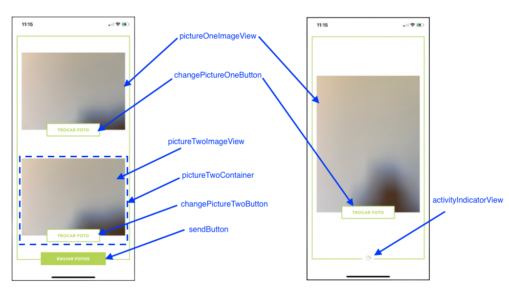

# Documentoscopia - Guia de implementação de view customizada

Além de poder usar o SDK em sua forma padrão de exibição, o SDK permite que a forma de visualização seja completamente customizada.

## Entendendo o funcionamento

O componente de Documentoscopia é dividido em três telas:

1. Tela inicial, onde o usuário deve escolhar se irá capturar apenas uma foto (com frente e verso) ou duas fotos (uma da frente e outra do verso)
2. Tela de captura das imagens, onde o usuário irá fotografar o documento.
3. Tela de confirmação, onde o usuário poderá confirmar se as fotos estão boas, e em caso negativo, poderá capturá-las novamente.

De forma semelhante ao Liveness, a customização do visual é feita através da implementação de UIViews, as quais devem implementar os respectivos protocolos descritos nas próximas seções, para o correto funcionamento do processo de documentoscopia. A diferença é que, neste caso, deve-se implementar 3 views, sendo um para cada tela citada anteriormente.

### 1. Tela inicial

Para customizar a tela inicial, é necessária a criação de uma `UIView` (via código ou via Interface Builder) que implemente o protocolo `DocHomeView`, que especifica os componentes que a view em questão precisa conter:

```swift
/// Protocolo que deve ser implementado pela view customizada da tela inicial de Documentoscopia
public protocol DocHomeView: UIView {

    // MARK: - Views obrigatórias

    /// View que deverá conter o conteúdo da tela, com exceção do activityIndicatorView
    var contentView: UIView! { get }
    /// Botão para selecionar a opção de uma foto só
    var singlePictureView: UIControl! { get }
    /// Botão para selecionar a opção de duas fotos
    var dualPictureView: UIControl! { get }
    /// UIView que será exibida em momentos de carregamento e validação
    var activityIndicatorView: UIView! { get }
    /// UIButton para fechar a tela
    var closeButton: UIButton! { get }
}
```

Na figura abaixo é possível visualizar o que cada uma das subviews representa na tela:


### 2. Tela de captura

Para customizar a tela de câmera, é necessária a criação de uma `UIView` (via código ou via Interface Builder) que implemente o protocolo `DocCameraView`, que especifica os componentes que a view em questão precisa conter:

```swift
/// Protocolo que deve ser implementado pela view customizada da tela de câmera de Documentoscopia
public protocol DocCameraView: UIView {

    // MARK: - Views obrigatórias

    /// Nesta view será colocado o preview da câmera.
    var cameraContainer: CameraPreviewView! { get }
    /// Botão para capturar foto.
    var captureButton: UIButton! { get }
    /// View que será exibida após a captura de uma imagem.
    var previewContainer: UIView! { get }
    /// UIImageView onde será exibida a imagem capturada para o usuário confirmar se ficou boa.
    var previewImageView: UIImageView! { get }
    /// Botão para que o usuário confirme a foto capturada.
    var usePictureButton: UIButton! { get }
    /// Botão para que o usuário capture a foto novamente.
    var takeNewPictureButton: UIButton! { get }
    /// View exibida quando o celular não estiver na orientação correta.
    var rotationContainer: UIView! { get }
    /// Texto informativo com orientação da captura, é exibido por apenas alguns segundos.
    var instructionLabel: UILabel! { get }
    /// UIButton para fechar a tela.
    var closeButton: UIButton! { get }
}
```

Na figura abaixo é possível visualizar o que cada uma das subviews representa na tela:


Na opção de foto única, o aparelho precisa estar na posição vertical/retrato para a captura das imagens, e, na opção de duas fotos, deverá estar na posição horizontal/paisagem. Caso o aparelho esteja na orientação errada, a view rotationContainer será exibida, orientando o usuário a rotacionar o aparelho.

### 3. Tela de confirmação

Para customizar a tela de confirmação, é necessária a criação de uma `UIView` (via código ou via Interface Builder) que implemente o protocolo `DocConfirmationView`, que especifica os componentes que a view em questão precisa conter:

```swift
/// Protocolo que deve ser implementado pela view customizada da tela de confirmação de Documentoscopia
public protocol DocConfirmationView: UIView {

    // MARK: - Views obrigatórias

    /// UIImageView para exibir a frente do documento, ou o documento completo, caso tenha sido escolhida a opção de foto única.
    var pictureOneImageView: UIImageView! { get }
    /// Botão para trocar a imagem da frente do documento, ou o documento completo, caso tenha sido escolhida a opção de foto única.
    var changePictureOneButton: UIButton! { get }
    /// Container para exibir o verso do documento.
    var pictureTwoContainer: UIView! { get }
    /// UIImageView para exibir o verso do documento.
    var pictureTwoImageView: UIImageView! { get }
    /// Botão para trocar a imagem do verso do documento.
    var changePictureTwoButton: UIButton! { get }
    /// Botão para realizar o envio do documento.
    var sendButton: UIButton! { get }
    /// UIView que será exibida em momentos de carregamento e validação
    var activityIndicatorView: UIView! { get }
}
```

Na figura abaixo é possível visualizar o que cada uma das subviews representa na tela:



Caso tenha sido escolhida a opção de foto única, a view pictureTwoContainer terá o valor do campo isHidden como true.

## Passando os parâmetros

Após implementadas as views, elas deverão ser passadas no construtor do `DocumentscopyViewController` através do argumento `customViewParam`, o qual é uma `struct` do tipo `DocumentscopyCustomViewParam`.
Além das três views customizadas, é possível passar as strings `camInstructionSingle`, `camInstructionFront` e `camInstructionBack`. Estas strings são as instruções que serão exibidas na label `instructionLabel` da tela de câmera.


```swift
let customViewParam = DocumentscopyCustomViewParam(
    homeView: DocHomeCustomView(frame: view.bounds),
    cameraView: DocCameraCustomView(frame: view.bounds),
    confirmationView: DocConfirmationCustomView(frame: view.bounds),
    camInstructionSingle: "Centralize o documento",
    camInstructionFront: "Centralize a frente",
    camInstructionBack: "Centralize o verso"
)

let controller = DocumentscopyViewController(appKey: appKey,
                                             baseURL: baseURL,
                                             documentscopyDelegate: self,
                                             customViewParam: customViewParam)
```

Caso qualquer um dos argumentos do construtor de `DocumentscopyCustomViewParam` seja `nil`, será usado o padrão.

# Observações

Além das subviews especificadas, as views customizadas pode conter outros elementos, apenas tomando cuidado para que os mesmos não interfiram nas subviews funcionais.

No projeto Sample, neste mesmo repositório, encontra-se um exemplo de implementação. Recomenda-se usar como ponto de partida as views inclusas neste sample, modificando-as de acordo com a necessidade.
