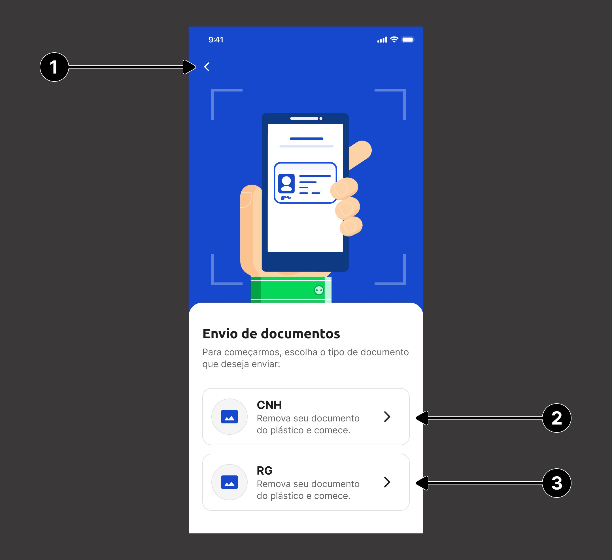
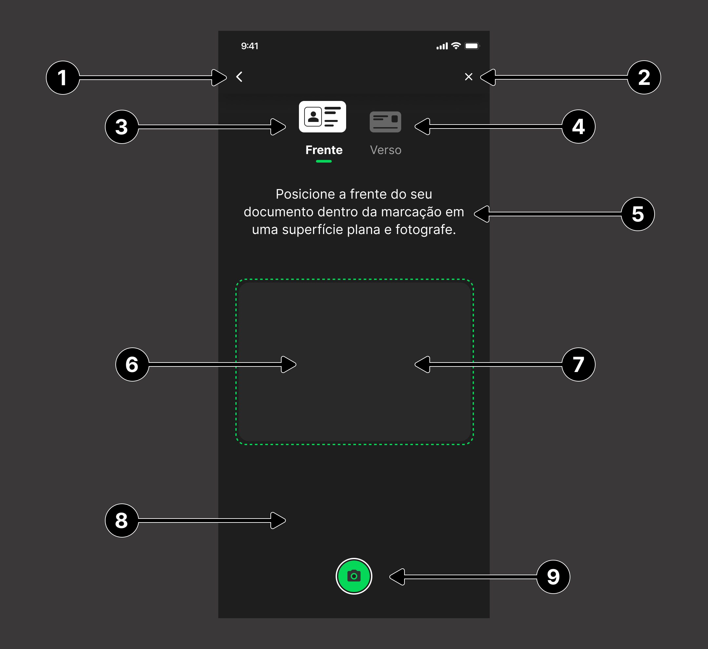
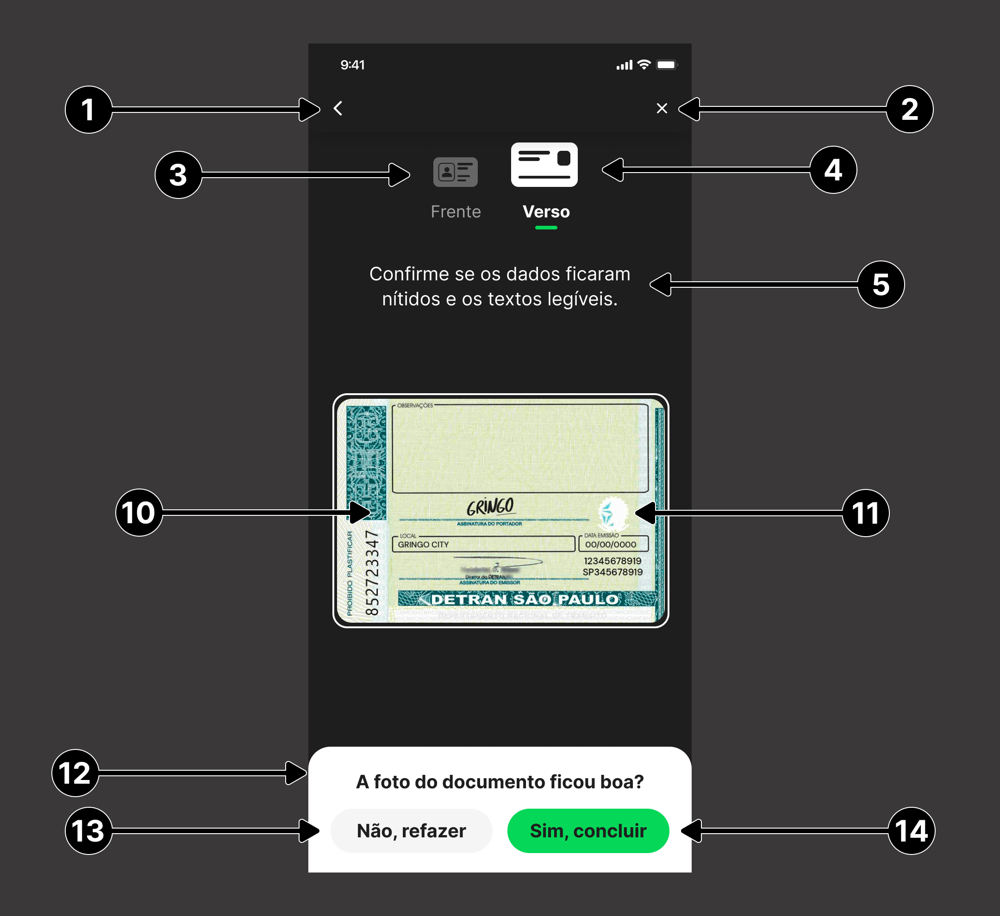
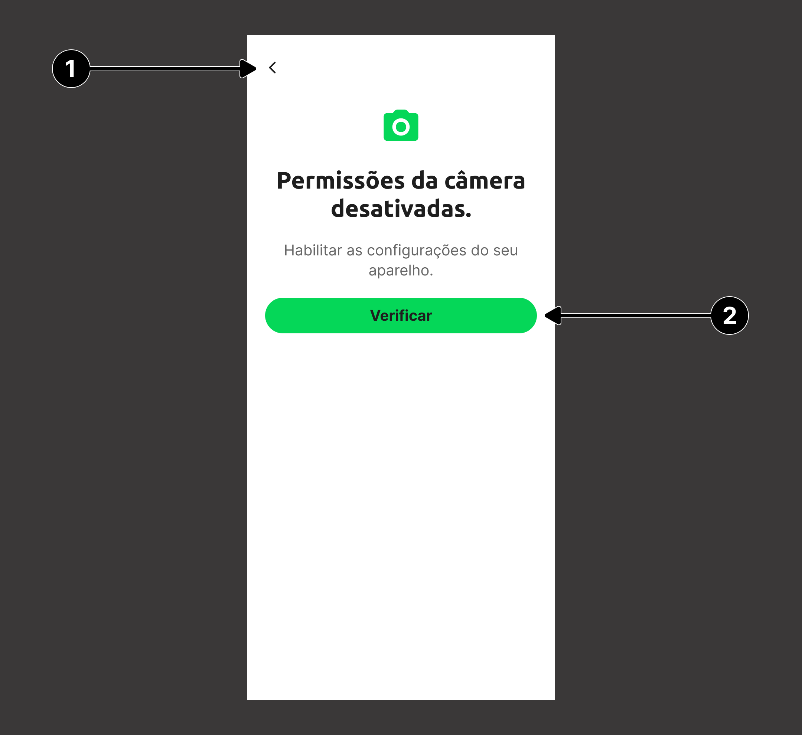
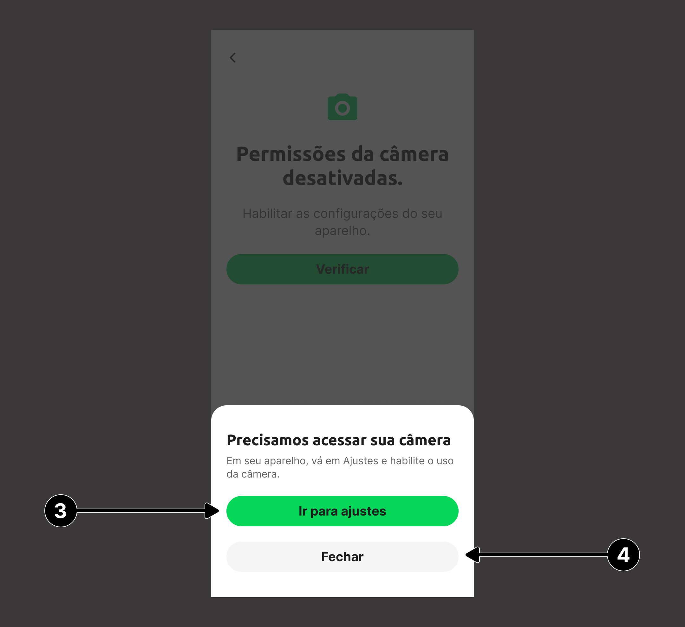
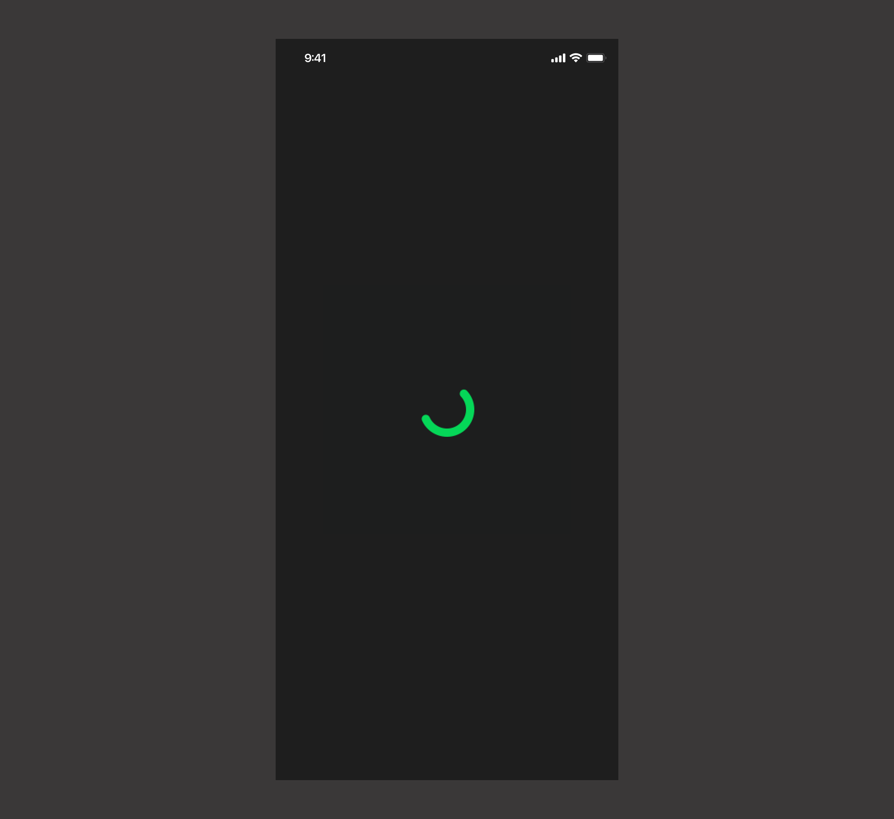
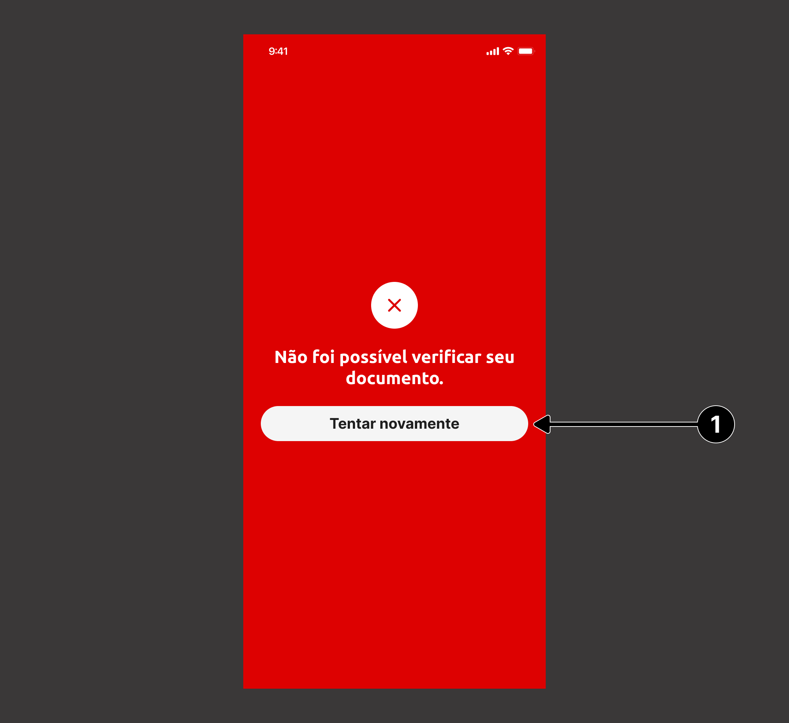
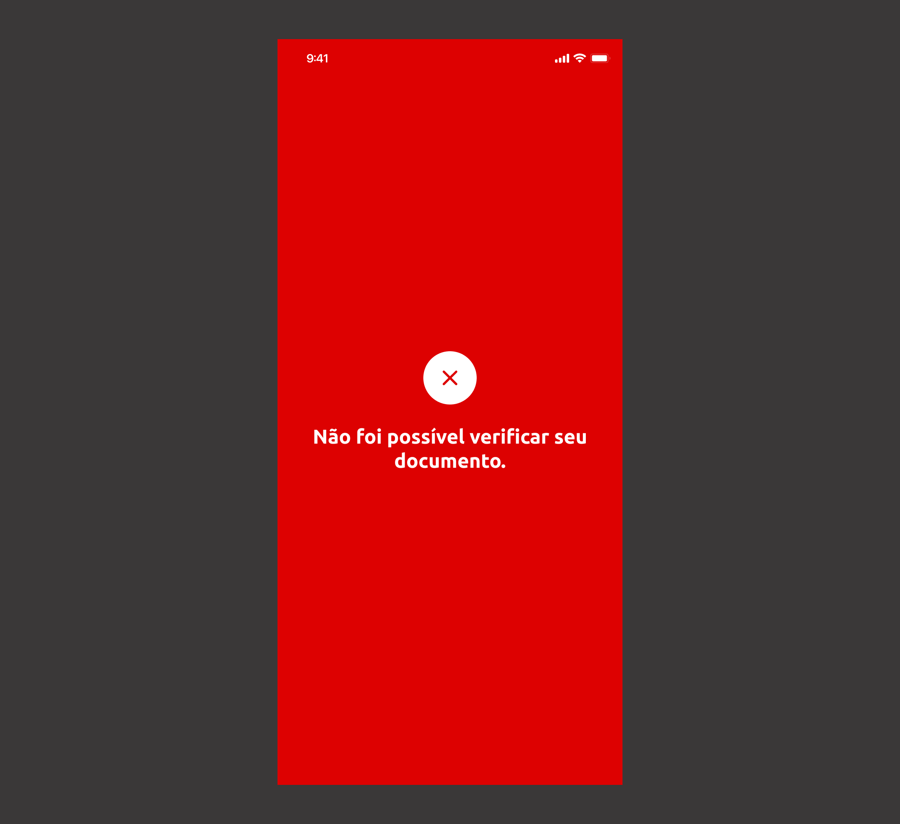

# Documentoscopia - Guia de customização

O SDK do OILiveness2D permite a customização das telas do fluxo da Documentoscopai, para isto, é necessária a criação de objetos do tipo `UIView` (via código ou via Interface Builder) que implementem os protocolos definidos para cada tela.

Além das subviews especificadas, a view customizada pode conter outros elementos, apenas tomando cuidado para que os mesmos não interfiram nas subviews funcionais.

### Implementação
Todas as *views* customizadas são passadas via construtor da classe ``DocumentscopyViewController``. Essas *views* são opcionais, logo não há necessidade de especificar todas, caso não seja necessário.

```swift
let controller = DocumentscopyViewController(
    appKey: appKey, baseURL: baseURL, delegate: self,
    customInstructionView: CustomInstructionView(),
    customView: CustomView(),
    customCameraPermissionView: CustomCameraPermissionView(),
    customLoadingView: CustomLoadingView(),
    customResultView: CustomResultView()
)
```

---

## Views Customizadas

### `customInstructionView`
Essa view deve estar em conformidade com o protocolo ``DocumentscopyCustomInstructionView`` que contém os seguintes atributos:

```swift
public protocol DocumentscopyCustomInstructionView: UIView {
    var backButton: UIButton! { get }
    var viewCNH: UIView! { get }
    var viewRG: UIView! { get }
}
```

| **Indice** | **Elemento** | **Descrição**                                                        |
| :--------- | :----------- | :------------------------------------------------------------------- |
| (**1**)    | `backButton` | Botão para função voltar da navegação.                               |
| (**2**)    | `viewCNH`    | View que terá a ação de iniciar o fluxo de captura do documento CNH. |
| (**3**)    | `viewRG`     | View que terá a ação de iniciar o fluxo de captura do documento RG.  |

<br/>


---

### `customView`
Essa view deve estar em conformidade com o protocolo ``DocumentscopyCustomCameraView`` que contém os seguintes atributos:

```swift
public protocol DocumentscopyCustomCameraView: UIView {
    var cameraPreview: DocumentscopyCameraPreviewView! { get }    
    var cameraMask: UIView! { get }
    var backButton: UIButton! { get }
    var closeButton: UIButton! { get }    
    var backIndicatorView: DocumentscopyIndicatorView! { get }    
    var frontIndicatorView: DocumentscopyIndicatorView! { get }    
    var instructionLabel: UILabel! { get }    
    var cameraVisualizer: UIView! { get }    
    var previewImageView: UIImageView! { get }    
    var captureButton: UIButton! { get }    
    var usePictureButton: DocumentscopyEditableButton! { get }    
    var takeNewPictureButton: UIButton! { get }

    func displayConfirmationSheet(visibility: DocumentscopyConfirmationSheetVisibility, animated: Bool)
}
```

| **Indice** | **Elemento**                                     | **Descrição**                                                                                                                                                                                                                                                                                                                                     |
| :--------- | :----------------------------------------------- | :------------------------------------------------------------------------------------------------------------------------------------------------------------------------------------------------------------------------------------------------------------------------------------------------------------------------------------------------ |
| (**1**)    | `backButton`                                     | UIButton para fechar a tela.                                                                                                                                                                                                                                                                                                                      |
| (**2**)    | `closeButton`                                    | UIButton para fechar a tela.                                                                                                                                                                                                                                                                                                                      |
| (**3**)    | `frontIndicatorView`                             | View que indica o momento de utilizar a frente do documento.                                                                                                                                                                                                                                                                                      |
| (**4**)    | `backIndicatorView`                              | View que indica o momento de utilizar o verso do documento.                                                                                                                                                                                                                                                                                       |
| (**5**)    | `instructionLabel`                               | Texto informativo com orientação da captura, é exibido por apenas alguns segundos.                                                                                                                                                                                                                                                                |
| (**6**)    | `cameraPreview`                                  | Nesta view será colocado o preview da câmera.                                                                                                                                                                                                                                                                                                     |
| (**7**)    | `cameraVisualizer`                               | View que determina onde o preview câmera será visível.                                                                                                                                                                                                                                                                                            |
| (**8**)    | `cameraMask`                                     | View que determina onde a camera não será visível.                                                                                                                                                                                                                                                                                                |
| (**9**)    | `captureButton`                                  | Botão para capturar foto.                                                                                                                                                                                                                                                                                                                         |
| (**10**)   | `previewImageView`                               | UIImageView onde será exibida a imagem capturada para o usuário confirmar se ficou boa.                                                                                                                                                                                                                                                           |
| (**11**)   | `takeNewPictureButton`                           | Botão para que o usuário capture a foto novamente.                                                                                                                                                                                                                                                                                                |
| (**12**)   | `usePictureButton`                               | Botão para que o usuário confirme a foto capturada.                                                                                                                                                                                                                                                                                               |
|            | `displayConfirmationSheet(visibility:animated:)` | Método que indica quando a *view* de confirmação de imagem deve ou não ser mostrada, esse método recebe dois parâmetro: **visibility** que é um `enum` do tipo ``DocumentscopyConfirmationSheetVisibility`` que indica o estado da *view* de confirmação e **animated** que indica se esse comportamento é recomendado de ser feito com animação. |

<br/>
<div>
    
    
<div/>

**DocumentscopyCameraPreviewView**

É uma classe customizada que herda de uma `UIView`.

<br/>

**DocumentscopyIndicatorView**

É `typealias` que força uma herança para o tipo `UIView` e obriga a assinatura do protocolo ``DocumentscopyIndicatorViewProtocol``.

```swift 
@objc public protocol DocumentscopyIndicatorViewProtocol {
    func setFocus(to value: Bool, animated: Bool)
}
```

| **Elemento**             | **Descrição**                                                                                                                                                    |
| :----------------------- | :--------------------------------------------------------------------------------------------------------------------------------------------------------------- |
| `setFocus(to:animated:)` | Método que indica se a *view* está ou não em foco. O parâmetro de **animated** indica quando a troca de foco do componente deve ou não ser animada (*opcional*). |
<br/>

**DocumentscopyEditableButton**

É `typealias` que força uma herança para o tipo `UIButton` e obriga a assinatura do protocolo ``DocumentscopyEditableButtonProtocol``.

```swift 
@objc public protocol DocumentscopyEditableButtonProtocol: AnyObject {
    func changeTitle(to newTitle: String)
}
```

| **Elemento**       | **Descrição**                       |
| :----------------- | :---------------------------------- |
| `changeTitle(to:)` | Método que altera o texto do botão. |

<br/>

**DocumentscopyConfirmationSheetVisibility**

```swift
public enum DocumentscopyConfirmationSheetVisibility {
    case displayed
    case hidden
}
```
---

### `customCameraPermissionView`
Essa view deve estar em conformidade com o protocolo ``DocumentscopyCustomCameraPermissionView`` que contém os seguintes atributos:

```swift
public protocol DocumentscopyCustomCameraPermissionView: UIView {
    var backButton: UIButton! { get }
    var checkPermissionButton: UIButton! { get }
    var openSettingsButton: UIButton! { get }
    var closeButton: UIButton! { get }
    
    func showBottomSheet()
}
```

| **Indice** | **Elemento**            | **Descrição**                                                                                              |
| :--------- | :---------------------- | :--------------------------------------------------------------------------------------------------------- |
| (**1**)    | `backButton`            | Botão para função voltar da navegação.                                                                     |
| (**2**)    | `checkPermissionButton` | Botão responsável por verificar a permissão de câmera e solicitá-la se necessário.                         |
| (**3**)    | `openSettingsButton`    | Botão que redireciona o usuário para o menu de permissões do aplicativo na configurações do dispositivo.   |
| (**4**)    | `closeButton`           | Botão que fechar o fluxo de validação da permissão de câmera e volta para tela anterior.                   |
|            | `showBottomSheet`       | Método responsável por indicar o momento de mostrar os botões de ``openSettingsButton`` e ``closeButton``. |

<br/>
<div>
    
    
<div/>

---

### `customLoadingView`
Essa view deve estar em conformidade com o tipo ``DocumentscopyCustomLoadingView`` que é um ``typealias`` para o tipo ``UIView``

<br/>


---

### `customResultView`
Essa view deve estar em conformidade com o protocolo ``DocumentscopyCustomResultView`` que contém os seguintes atributos:

```swift
public protocol DocumentscopyCustomResultView: UIView {
    var resultButton: UIButton! { get }
    
    func display(for resultType: DocumentscopyResultType)
}
```

| **Indice** | **Elemento**    | **Descrição**                                                                                                              |
| :--------- | :-------------- | :------------------------------------------------------------------------------------------------------------------------- |
| (**1**)    | `resultButton`  | Botão para fechar o fluxo de reconhecimento de documento.                                                                  |
|            | `display(for:)` | Esse método recebe como parâmetro um `enum` do tipo `DocumentscopyResultType` que indica qual resultado deve ser mostrado. |

<br/>

| **Tipo de resultado** | **Exemplo de tela**                                                  |
| :-------------------- | :------------------------------------------------------------------- |
| Sucesso               |   |
| Tente Novamente       |  |
| Erro                  |     |

**DocumentscopyResultType**

```swift
public enum DocumentscopyResultType {
    case success
    case tryAgain
    case error(DocumentscopyError)
}
```