# Documentoscopia 
Saiba como implementar a customização de view (telas), conforme a sua necessidade.

Você pode utilizar o SDK padrão e por meio dele, também customizar a visualização dessas telas.

## Entenda como funciona

O **componente** de Documentoscopia **é dividido em treze telas**:

### 1. Tela inicial
O usuário define qual o tipo de documento que deseja enviar:

<div>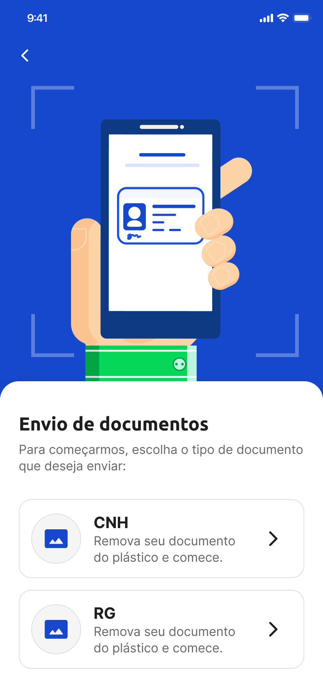</div>

### 2. Tela de captura do documento (frente)
O usuário recebe a instrução de captura da frente do documento, dentro da marcação apresentada:

<div></div>

### 3. Abaixo, um exemplo de como esse documento deve ficar posicionado:

<div>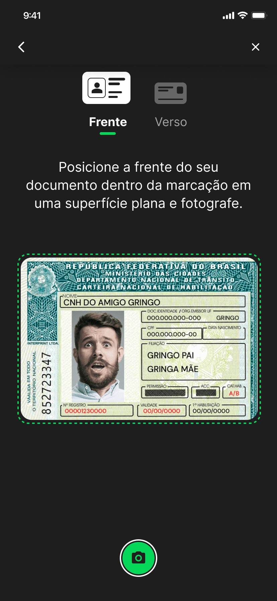</div>

### 4. Tela de confirmação da captura do documento (frente)
Nesta tela, o usuário deve confirmar se a imagem do documento capturado está em boa qualidade, clicando em Não, refazer ou Sim:

<div>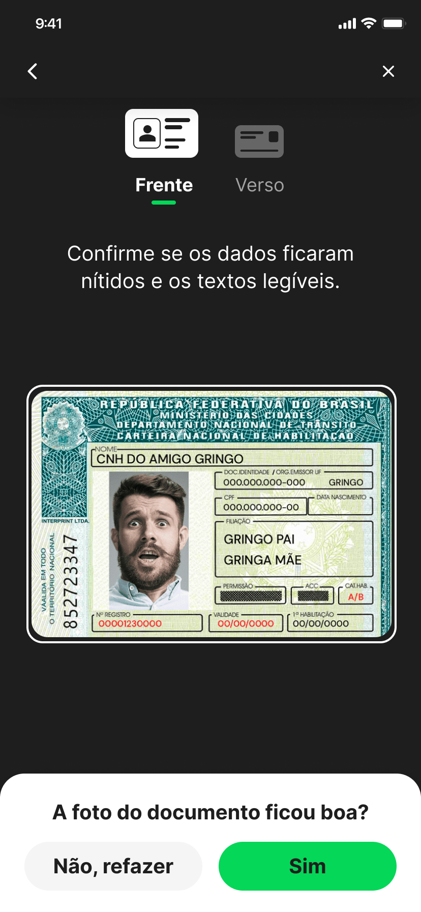</div>

### 5. Tela de captura do documento (verso)
O usuário recebe a instrução de captura do verso do documento, dentro da marcação apresentada:

<div>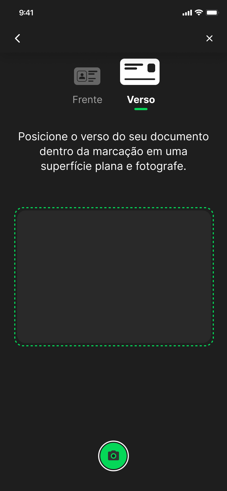</div>

### 6. Abaixo, um exemplo de como esse documento deve ficar posicionado:

<div>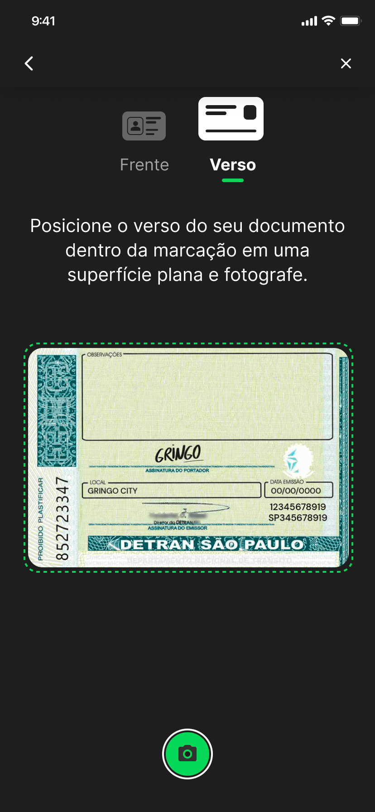</div>

### 7. Tela de confirmação da captura do documento (verso)
Nesta tela, o usuário deve confirmar se a imagem do documento capturado está em boa qualidade, clicando em Não, refazer ou Sim:

<div>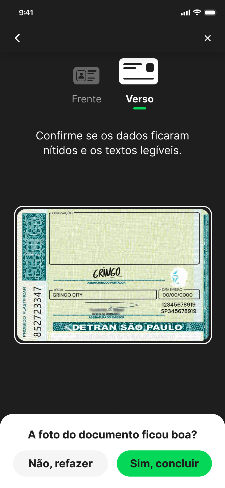</div>

### 8. Tela de processamento do envio do documento
A próxima tela que o usuário deve ver é a tela de processamento do envio do documento:

<div>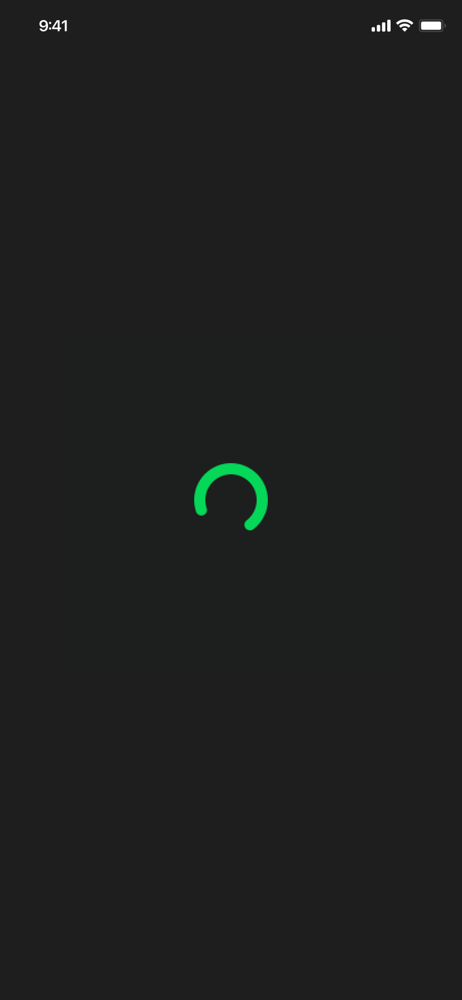</div>

### 9. Tela de conclusão do envio do documento (sucesso)
O usuário receberá uma notificação de **sucesso** caso o envio do documento seja concluído com sucesso:

<div>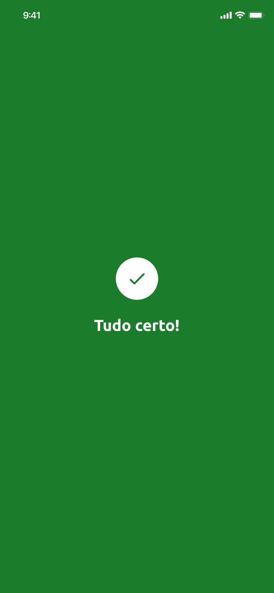</div>

### 10. Tela de conclusão do envio do documento (erro)
O usuário receberá uma notificação de **erro** caso exista uma falha após conclusão do envio do documento:

<div>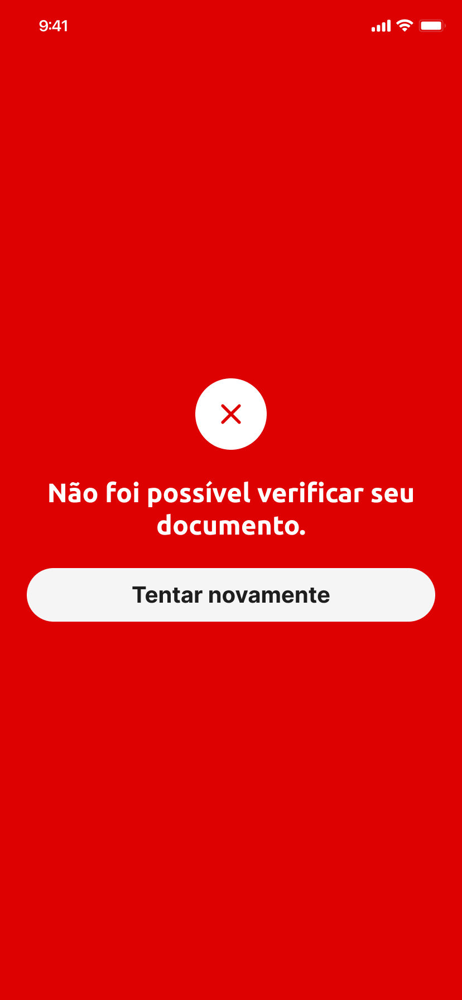</div>

### 11. Notificação da câmera do dispositivo desativada:
Antes do passo 2 (Tela de captura do documento (frente)), o usuário será notificado caso a permissão para acessar a câmera estiver desativada:

<div>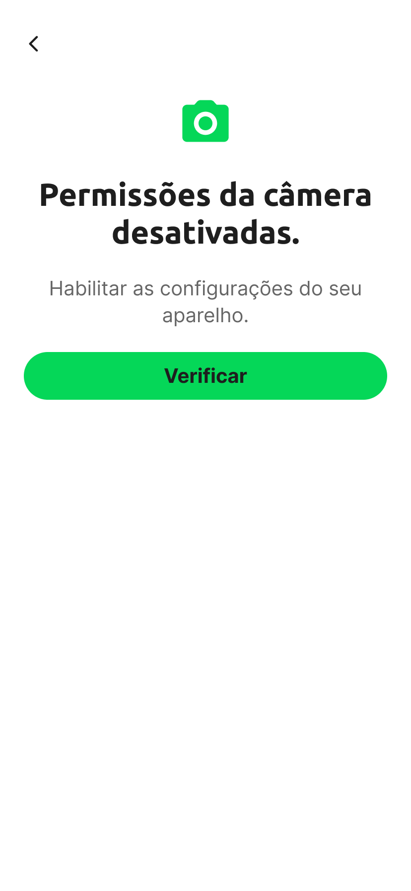</div>

### 12. Tela de instrução para habilitar câmera:
Caso a câmera do dispositivo esteja desativada, o usuário deve receber as instruções de como habilitar:

<div>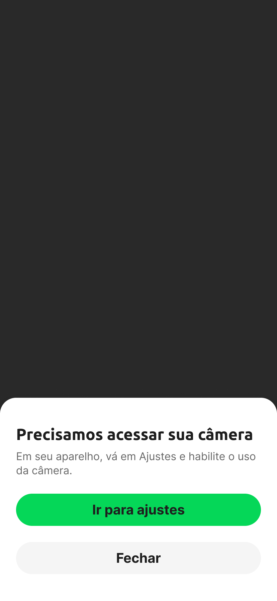</div>

### 13. Notificação para dispositivo sem internet
Caso seja identificado que o dispositivo não tem acesso a internet, o usuário deve receber a seguinte notificação:

<div>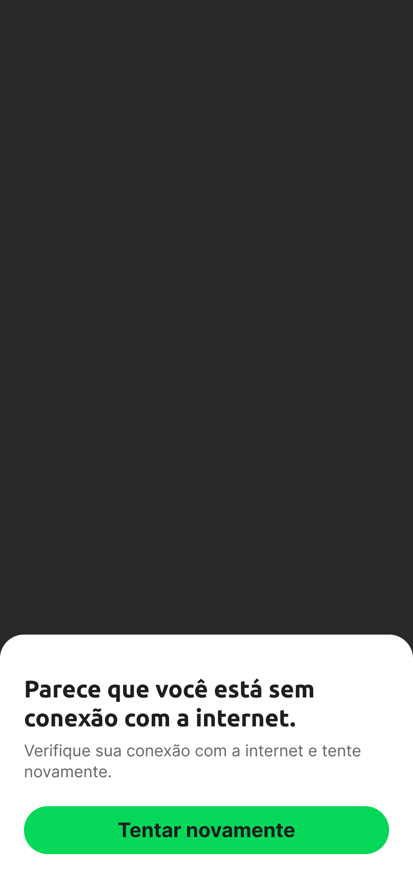</div>

A customização das telas é semelhante ao **Liveness**. Ela é feita por meio da implementação de UIViews.

A diferença é que, neste caso, deve-se implementar duas views, sendo um para cada tela citada anteriormente.

Para realizar essa implementação é necessário seguir alguns protocolos, para o funcionamento correto do processo de **documentoscopia**. Veja a seguir:

## Instalação e configuração das telas customizáveis

### 1. Tela inicial

Para customizar a tela inicial, é necessária a criação de uma `UIView` (via código ou via Interface Builder) que implemente o protocolo `DocumentscopyCustomView`, que especifica os componentes que a view em questão precisa conter:

```swift
/// Protocolo que deve ser implementado pela view customizada da tela inicial de Documentoscopia
public protocol DocumentscopyCustomView: UIView {
    /// Botão para função voltar da navegação
    var backButton: UIButton! { get }

    /// View que terá a ação de iniciar o fluxo de captura do documento CNH
    var viewCNH: UIView! { get }

    /// View que terá a ação de iniciar o fluxo de captura do documento RG
    var viewRG: UIView! { get }
}
```

Na figura abaixo é possível visualizar o que cada uma das subviews representa na tela:

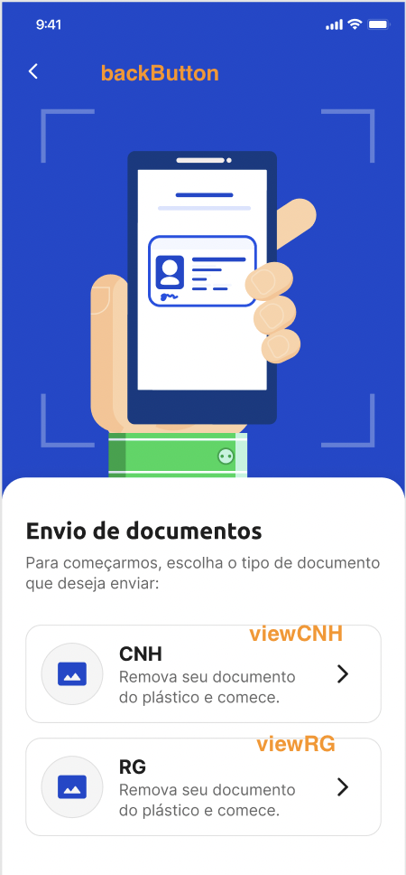

### 2. Tela de captura

Para customizar a tela de câmera, é necessária a criação de uma `UIView` (via código ou via Interface Builder) que implemente o protocolo `DocumentscopyCustomCameraView`, que especifica os componentes que a view em questão precisa conter:

```swift
/// Protocolo que deve ser implementado pela view customizada da tela de câmera de Documentoscopia
public protocol DocumentscopyCustomCameraView: UIView {
    /// Nesta view será colocado o preview da câmera.
    var cameraPreview: DocumentscopyCameraPreviewView! { get }
    
    /// Botão para capturar foto.
    var captureButton: UIButton! { get }
    
    /// View que será exibida após a captura de uma imagem.
    var previewContainer: UIView! { get }
    
    /// UIImageView onde será exibida a imagem capturada para o usuário confirmar se ficou boa.
    var previewImageView: UIImageView! { get }
    
    /// Botão para que o usuário confirme a foto capturada.
    var usePictureButton: UIButton! { get }
    
    /// Botão para que o usuário capture a foto novamente.
    var takeNewPictureButton: UIButton! { get }
    
    /// Texto informativo com orientação da captura, é exibido por apenas alguns segundos.
    var instructionLabel: UILabel! { get }
    
    /// UIButton para fechar a tela.
    var closeButton: UIButton! { get }
    
    /// UIButton para fechar a tela.
    var backButton: UIButton! { get }
    
    /// UIView de confirmação
    var containerConfirmation: UIView! { get }
    
    /// Constraint que será alterada para mostrar ou esconder a UIView de confirmação
    var bottomViewConfirmationTopConstraint: NSLayoutConstraint! { get }
    
    /// View que indica o momento de utilizar o verso do documento
    var viewVerso: DocumentscopyCameraIndicatorView! { get }
    
    /// View que indica o momento de utilizar a frente do documento
    var viewFrente: DocumentscopyCameraIndicatorView! { get }
    
    /// View que determina onde a camera não será visível
    var cameraMask: UIView! { get }
    
    /// View que determina onde o preview câmera será visível
    var cameraContainerVisualizer: UIView! { get }
}
```

Na figura abaixo é possível visualizar o que cada uma das subviews representa na tela:

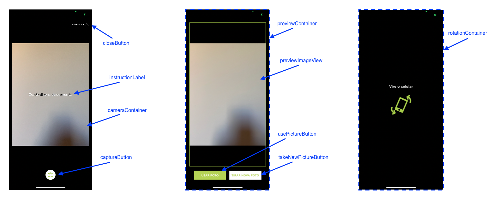

## Passando os parâmetros

Após implementadas as views, elas deverão ser passadas no construtor do `DocumentscopyViewController` através dos argumentos `customView` e `customCameraView` que representam respectivamente, a tela inicial e a tela de captura das imagens do documento.

```swift
let controller = DocumentscopyViewController(
    appKey: appKey, 
    baseURL: baseURL,
    delegate: self, 
    customView: CustomView(),
    customCameraView: CustomCameraView()
)
```

Caso qualquer um desses dois argumentos seja `nil`, será usado o *layout* padrão.

# Observações

Além das subviews especificadas, as views customizadas pode conter outros elementos, apenas tomando cuidado para que os mesmos não interfiram nas subviews funcionais.

No projeto Sample, neste mesmo repositório, encontra-se um exemplo de implementação. Recomenda-se usar como ponto de partida as views inclusas neste sample, modificando-as de acordo com a necessidade.
