# Documentoscopia 
Saiba como implementar a customização de view (telas), conforme a sua necessidade.

Você pode utilizar o SDK padrão e por meio dele, também customizar a visualização dessas telas.

## Entenda como funciona

O **componente** de Documentoscopia **é dividido em treze telas**:

### 1. Tela inicial
O usuário define qual o tipo de documento que deseja enviar:

<div></div>

### 2. Tela de captura do documento (frente)
O usuário recebe a instrução de captura da frente do documento, dentro da marcação apresentada:

<div>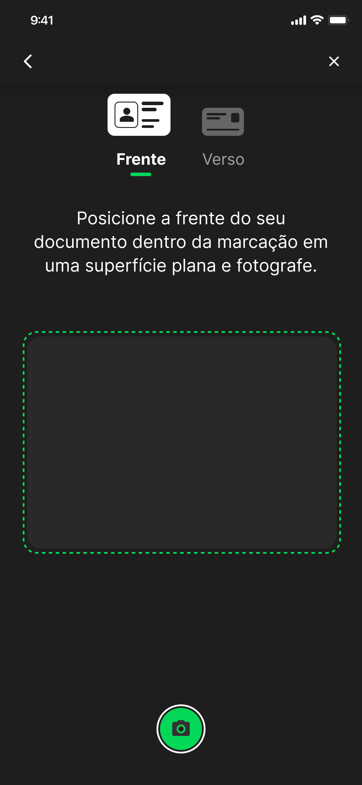</div>

### 3. Abaixo, um exemplo de como esse documento deve ficar posicionado

<div></div>

### 4. Tela de confirmação da captura do documento (frente)
Nesta tela, o usuário deve confirmar se a imagem do documento capturado está em boa qualidade, clicando em Não, refazer ou Sim:

<div>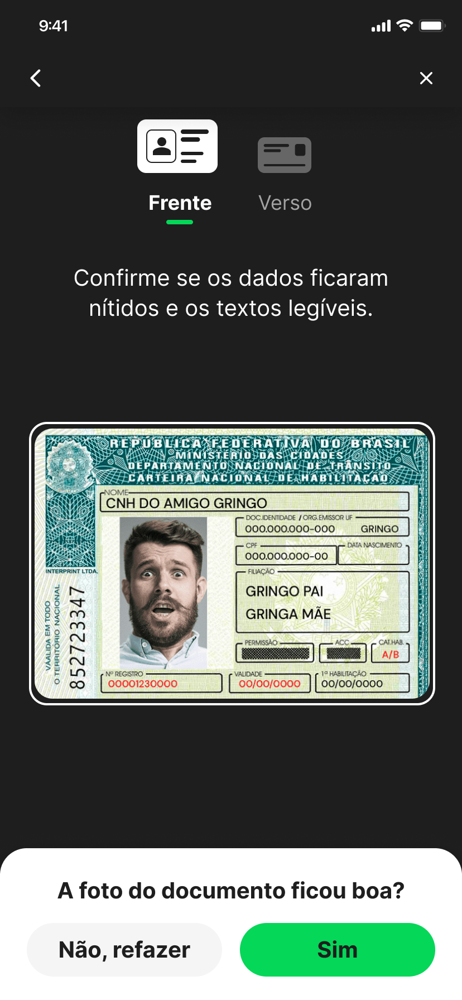</div>

### 5. Tela de captura do documento (verso)
O usuário recebe a instrução de captura do verso do documento, dentro da marcação apresentada:

<div>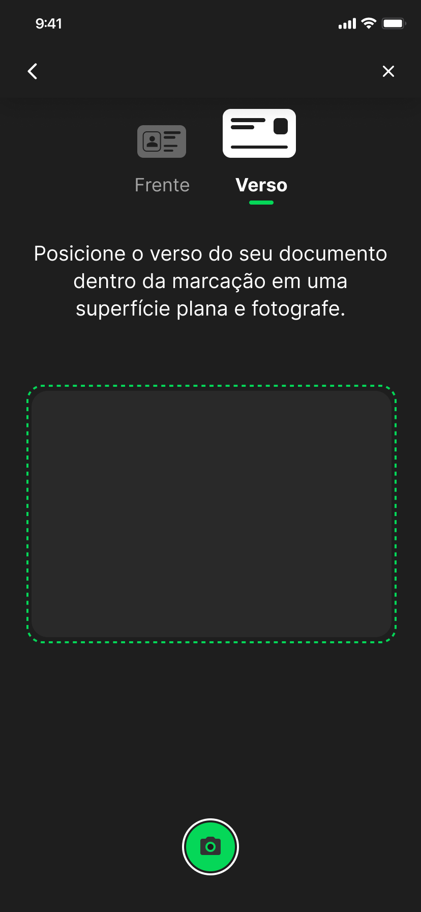</div>

### 6. Abaixo, um exemplo de como esse documento deve ficar posicionado

<div>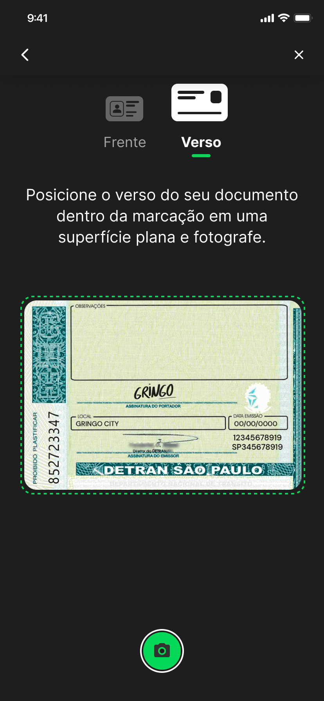</div>

### 7. Tela de confirmação da captura do documento (verso)
Nesta tela, o usuário deve confirmar se a imagem do documento capturado está em boa qualidade, clicando em Não, refazer ou Sim:

<div></div>

### 8. Tela de processamento do envio do documento
A próxima tela que o usuário deve ver é a tela de processamento do envio do documento:

<div>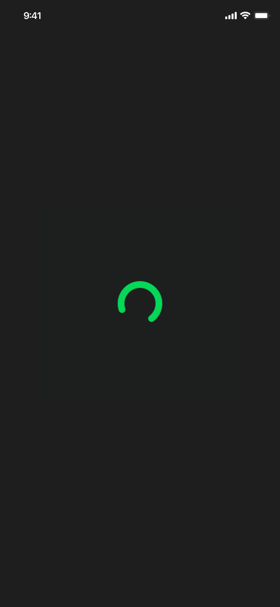</div>

### 9. Tela de conclusão do envio do documento (sucesso)
O usuário receberá uma notificação de **sucesso** caso o envio do documento seja concluído com sucesso:

<div>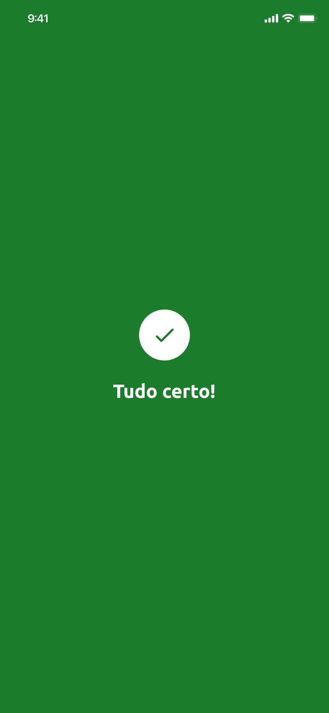</div>

### 10. Tela de processamento do documento (erro)
O usuário receberá uma notificação de erro ao processar o documento:

<div>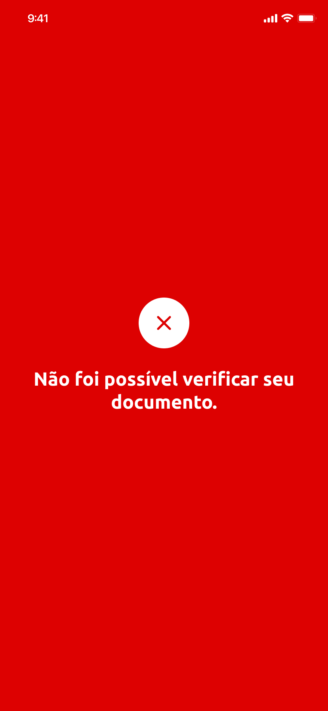</div>

### 11. Tela para tentar processar o documento novamente (erro)
Nesta tela o usuário poderá clicar no botão **Tentar novamente**, após a mensagem de erro:

<div></div>

### 12. Notificação da câmera do dispositivo desativada
Antes do passo 2 (Tela de captura do documento (frente)), o usuário será notificado caso a permissão para acessar a câmera estiver desativada:

<div>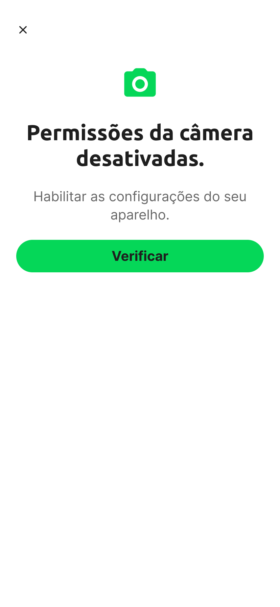</div>

### 13. Tela com mensagem do iOS para  direcionar o usuário a tela de configuração
Ao clicar no botão **Verificar** do passo anterior, o dispositivo apresenta uma mensagem na tela para direcionar ou não o usuário para a tela de configuração:

<div>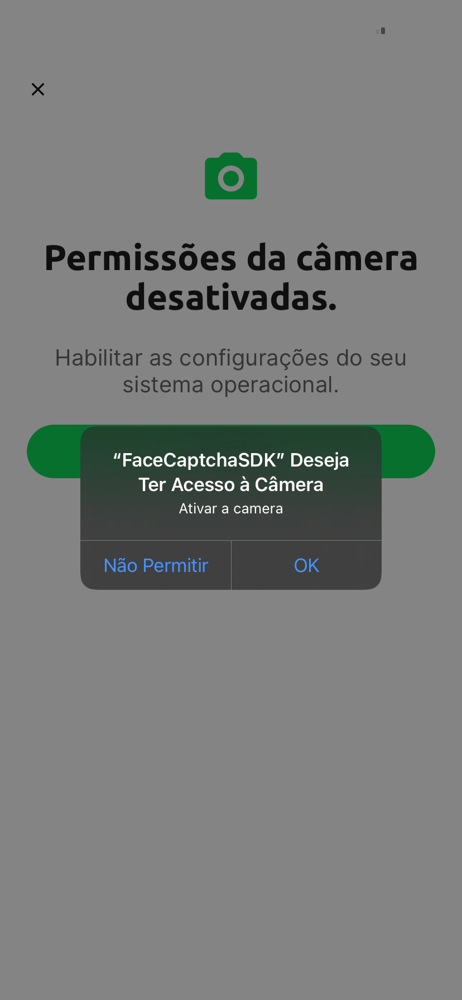</div>

**Obs.:** Por padrão, a Apple apresenta essa mensagem de configuração apenas uma vez. As próximas vezes o usuário terá que ir até a tela de configurações para dar permissão para a câmera manualmente.

### 14. Tela de instrução para habilitar câmera:
Caso a solicitação seja recusada pelo usuário, neste passo é apresentado a mensagem para direciona-lo às configurações:

<div>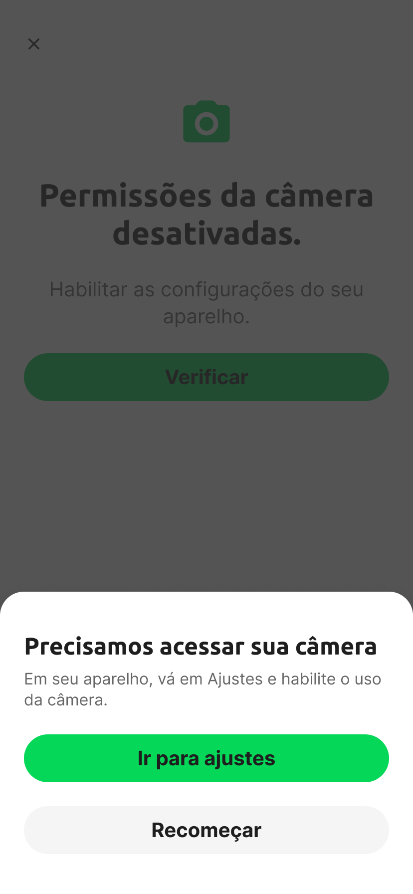</div>

---

## Instalação e configuração das telas customizáveis

A customização das telas é semelhante ao **Liveness**. Ela é feita por meio da criação de objetos do tipo **UIViews**(via código ou via Interface Builder), que implementem os protocolos definidos para cada tela.

Além das subviews especificadas, a view customizada pode conter outros elementos, apenas tomando cuidado para que os mesmos não interfiram nas subviews funcionais.

Para realizar essa implementação é necessário seguir alguns protocolos, para o funcionamento correto do processo de **documentoscopia**. 
Veja a seguir:

### Implementação

Todas as *views* customizadas são passadas via construtor da classe ``DocumentscopyViewController``. Essas *views* são opcionais, logo não há necessidade de especificar todas, caso não seja necessário.

```swift
let controller = DocumentscopyViewController(
    appKey: appKey, 
    environment: .HML, 
    delegate: self,
    customInstructionView: CustomInstructionView(),
    customView: CustomView(),
    customCameraPermissionView: CustomCameraPermissionView(),
    customLoadingView: CustomLoadingView(),
    customResultView: CustomResultView()
)

```
**Caso qualquer um seja `nil`, será usado o *layout* padrão.**

## 1. Tela inicial

### `customInstructionView`
Essa view deve estar em conformidade com o protocolo ``DocumentscopyCustomInstructionView`` que contém os seguintes atributos:

```swift
public protocol DocumentscopyCustomInstructionView: UIView {
    var backButton: UIButton! { get }
    var viewCNH: UIView! { get }
    var viewRG: UIView! { get }

    func changeLoadingVisibility(to visibility: LoadingVisibility)
}
```

| **Indice** | **Elemento** | **Descrição** |
|:-----------|:-------------|:--------------|
| (**1**) | `backButton` | Botão para função voltar da navegação. |
| (**2**) | `viewCNH` | View que terá a ação de iniciar o fluxo de captura do documento CNH. |
| (**3**) | `viewRG` | View que terá a ação de iniciar o fluxo de captura do documento RG. |
|         | `changeLoadingVisibility(to:)` | Método responsável por indicar o estado do *loading* na tela de instruções, podendo receber dois valores: **hidden** (esconder o loading) e **displayed** (mostrar o loading). |

<br/>
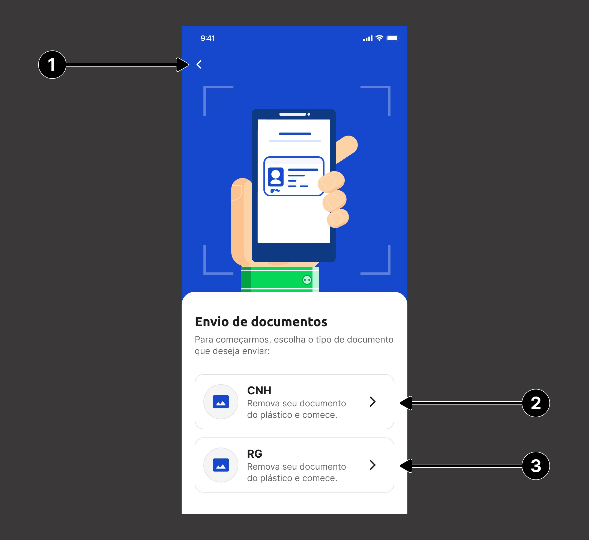

---

## 2. Tela de captura do documento

### `customView`
Essa view deve estar em conformidade com o protocolo ``DocumentscopyCustomView`` que contém os seguintes atributos:

```swift
public protocol DocumentscopyCustomView: UIView {
    var cameraPreview: DocumentscopyCameraPreviewView! { get }    
    var cameraMask: UIView! { get }
    var backButton: UIButton! { get }
    var closeButton: UIButton! { get }    
    var backIndicatorView: UIView! { get }    
    var frontIndicatorView: UIView! { get }    
    var instructionLabel: UILabel! { get }    
    var cameraVisualizer: UIView! { get }    
    var previewImageView: UIImageView! { get }    
    var captureButton: UIButton! { get }    
    var usePictureButton: UIButton! { get }    
    var takeNewPictureButton: UIButton! { get }

    func displayConfirmationSheet(visibility: DocumentscopyConfirmationSheetVisibility, animated: Bool)
    func setFocus(to focusElement: DocumentscopyFocusIndicator, animated: Bool)
    func setUsePictureButtonTitle(to newTitle: String)
}
```

| **Indice** | **Elemento** | **Descrição** |
|:-----------|:-------------|:--------------|
| (**1**) | `backButton` | UIButton para fechar a tela. |
| (**2**) | `closeButton` | UIButton para fechar a tela. |
| (**3**) | `frontIndicatorView` | View que indica o momento de utilizar a frente do documento. |
| (**4**) | `backIndicatorView` | View que indica o momento de utilizar o verso do documento. |
| (**5**) | `instructionLabel` | Texto informativo com orientação da captura, é exibido por apenas alguns segundos. |
| (**6**) | `cameraPreview` | Nesta view será colocado o preview da câmera. |
| (**7**) | `cameraVisualizer` | View que determina onde o preview câmera será visível. |
| (**8**) | `cameraMask` | View que determina onde a camera não será visível. |
| (**9**) | `captureButton` | Botão para capturar foto. |
| (**10**) | `previewImageView` | UIImageView onde será exibida a imagem capturada para o usuário confirmar se ficou boa. |
| (**11**) | `takeNewPictureButton` | Botão para que o usuário capture a foto novamente. |
| (**12**) | `usePictureButton` | Botão para que o usuário confirme a foto capturada. |
|          | `displayConfirmationSheet(visibility:animated:)` | Método que indica quando a *view* de confirmação de imagem deve ou não ser mostrada, esse método possui dois parâmetros: <br/> - **visibility** que é um `enum` do tipo ``DocumentscopyConfirmationSheetVisibility`` que indica o estado da *view* de confirmação;<br/> - **animated** que indica quando é recomendado que esse comportamento seja feito com animação. |
|          | `setFocus(to:animated:)` | Método que indica qual o indicador de face do documento deve estar em foco no momento, esse método possui dois parâmetros: <br/> - **to (*focusElement*)** que é um `enum` do tipo ``DocumentscopyFocusIndicator`` que possui os valores de *frontIndicator* e *backIndicator* que representam a frente e o verso do documento respectivamente;<br/> - **animated** que indica quando é recomendado que esse comportamento seja feito com animação. |
|          | `setUsePictureButtonTitle(to:)` | Método responsável por atribuir um novo titlulo para o botão de usar foto (`usePictureButton`). |

<br/>
<div>
    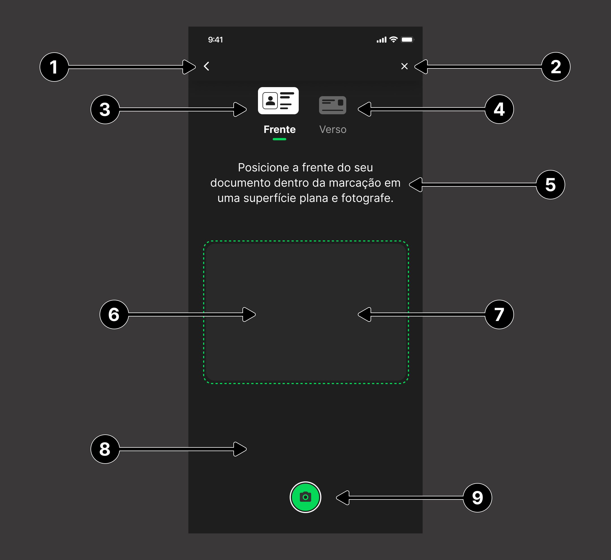
    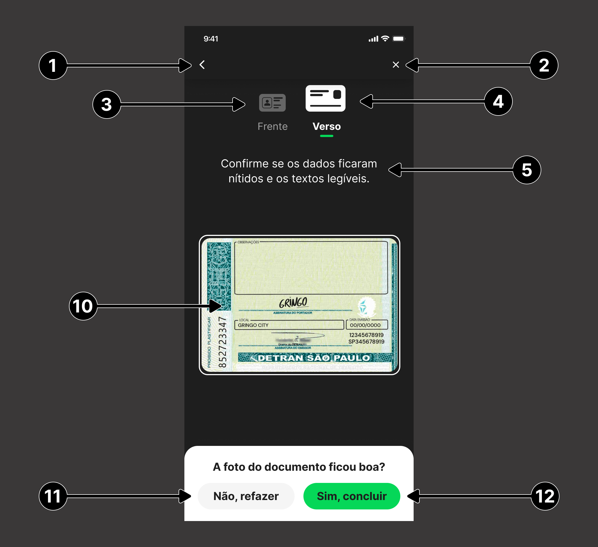
<div/>
    
**DocumentscopyCameraPreviewView**

É uma classe customizada que herda de uma `UIView` e que deve seguir duas regras:
1. Deve ser a *view* com maior profundidade na tela (*primeira view a ser adicionada na tela*) em relação as demais *views* do procotolo `DocumentscopyCustomView`.
2. As *constraints* de *leading*, *trailing*, *bottom* e *top* devem ser iguais a *superview* e não a *safearea*.

<br/>

**DocumentscopyConfirmationSheetVisibility**

```swift
public enum DocumentscopyConfirmationSheetVisibility {
    case displayed
    case hidden
}
```

<br/>

**DocumentscopyFocusIndicator**

```swift
public enum DocumentscopyFocusIndicator {
    case frontIndicator
    case backIndicator
}
```

> **Observações**:
> - A propriedade *cameraMask* assim como a *cameraPreview* deve possuir suas *constraints* de *leading*, *trailing*, *bottom* e *top* iguais a *superview* e não a *safearea*.
> - A propriedade *cameraMask* deve ser adicionada após a *cameraPreview*.

---
    
## 3. Tela de processamento do documento
    
### `customLoadingView`

Essa view deve estar em conformidade com o tipo ``DocumentscopyCustomLoadingView`` que é um ``typealias`` para o tipo ``UIView``

<br/>
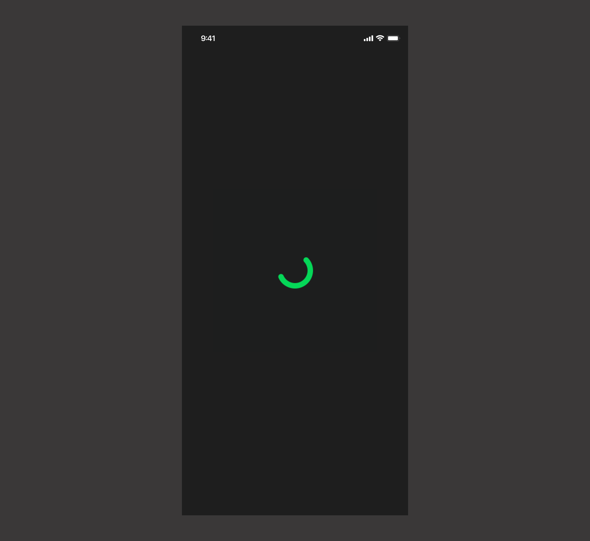

---

## 4. Tela de Resultado do Processamento
    
### `customResultView`

Essa view deve estar em conformidade com o protocolo ``DocumentscopyCustomResultView`` que contém os seguintes atributos:

```swift
public protocol DocumentscopyCustomResultView: UIView {
    var resultButton: UIButton! { get }
    
    func display(for resultType: DocumentscopyResultType)
}
```

| **Indice** | **Elemento** | **Descrição** |
|:-----------|:-------------|:--------------|
| (**1**) | `resultButton` | Botão para fechar o fluxo de reconhecimento de documento. |
|         | `display(for:)` | Esse método recebe como parâmetro um `enum` do tipo `DocumentscopyResultType` que indica qual resultado deve ser mostrado. |

<br/>

| **Tipo de resultado** | **Exemplo de tela** |
|:----------------------|:--------------------|
| Sucesso | 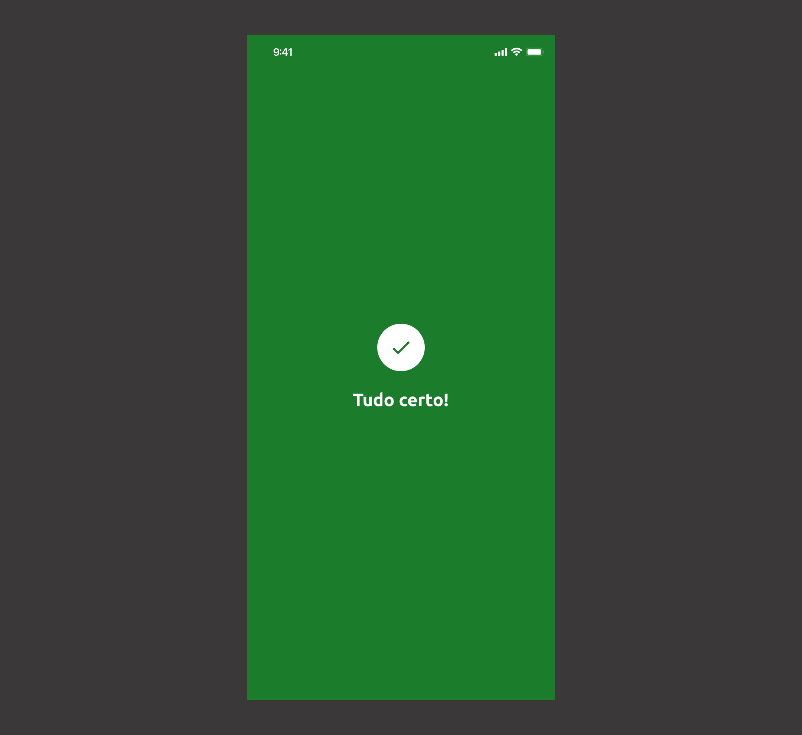 |
| Tente Novamente | 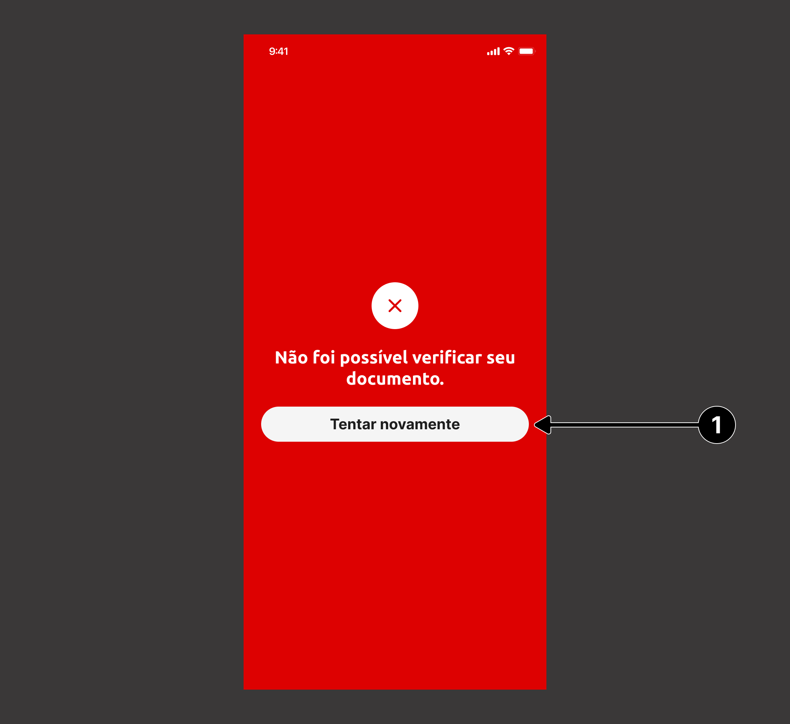 |
| Erro | 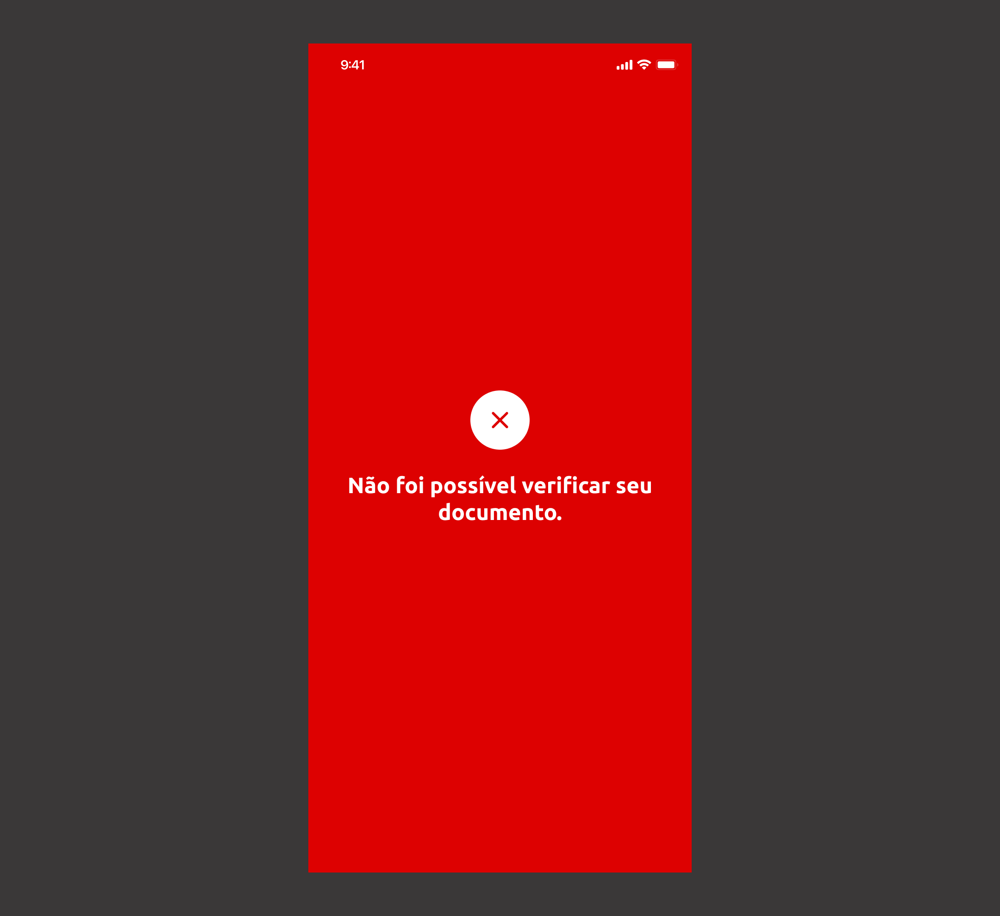 |

**DocumentscopyResultType**

```swift
public enum DocumentscopyResultType {
    case success
    case tryAgain
    case error(DocumentscopyError)
}
```   
---
    
## 5. Tela de permissão da câmera

### `customCameraPermissionView`

Essa view deve estar em conformidade com o protocolo ``DocumentscopyCustomCameraPermissionView`` que contém os seguintes atributos:

```swift
public protocol DocumentscopyCustomCameraPermissionView: UIView {
    var backButton: UIButton! { get }
    var checkPermissionButton: UIButton! { get }
    var openSettingsButton: UIButton! { get }
    var closeButton: UIButton! { get }
    
    func showBottomSheet(visibility: Visibility)
}
```

| **Indice** | **Elemento** | **Descrição** |
|:-----------|:-------------|:--------------|
| (**1**) | `backButton` | Botão que fecha o SDK e retorna o erro *noCameraPermission*. |
| (**2**) | `checkPermissionButton` | Botão responsável por verificar a permissão de câmera e solicitá-la se necessário. |
| (**3**) | `openSettingsButton` | Botão que redireciona o usuário para o menu de permissões do aplicativo na configurações do dispositivo. |
| (**4**) | `closeButton` | Botão que fecha o SDK e retorna o erro *noCameraPermission*. |
|         | `showBottomSheet(visibility:)` | Método responsável por indicar o momento de mostrar os botões de ``openSettingsButton`` e ``closeButton``, podendo receber dois valores: **hidden** (esconder os botões) e **displayed** (mostrar os botões). |

<br/>
<div>
    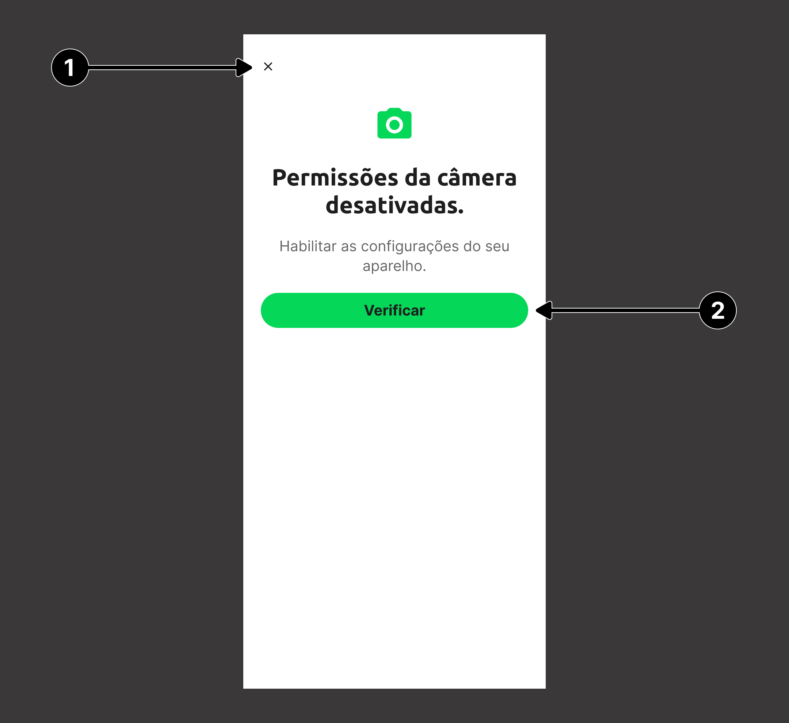
    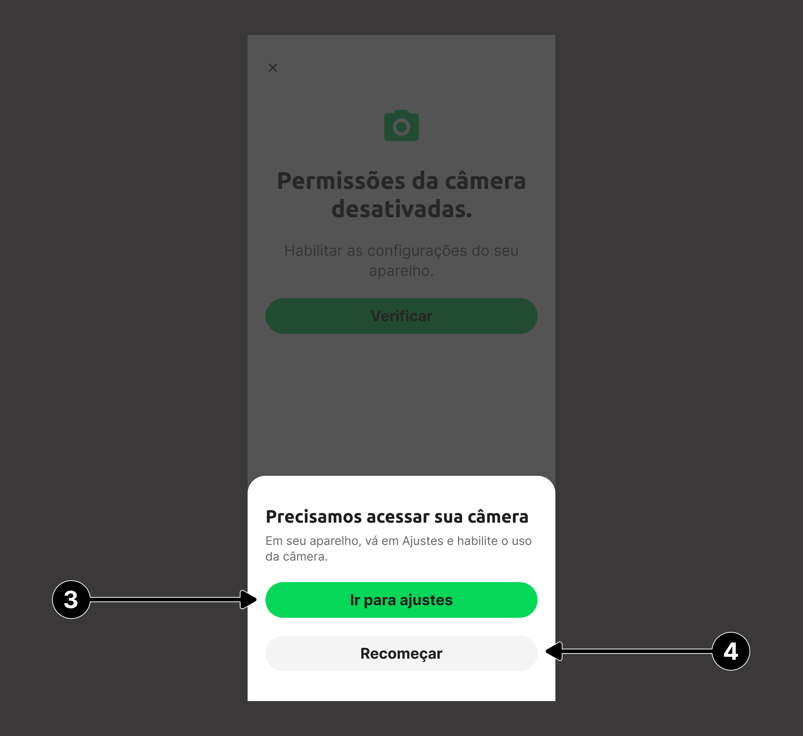
<div/>

---
    
## Observações

No projeto Sample, neste mesmo repositório, encontra-se um exemplo de implementação. Recomenda-se usar como ponto de partida as views inclusas neste sample, modificando-as de acordo com a necessidade.
