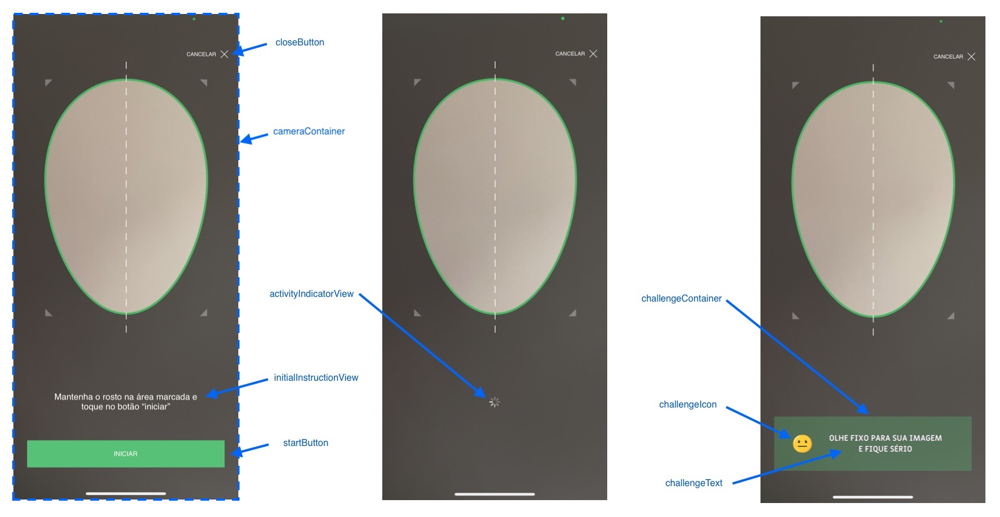

# Liveness - Guia de implementação de view customizada

A partir da versão 2.0.0, o SDK Liveness permite que a forma de visualização seja completamente customizada. Para isto, é necessária a criação de uma `UIView` (via código ou via Interface Builder) que implemente o protocolo `FaceCaptchaView`, que especifica alguns componentes que a view em questão precisa conter:

```swift
/// Protocolo que deve ser implementado pela view customizada
public protocol FaceCaptchaView: UIView {

    // MARK: - Views obrigatórias

    /// Nesta view será colocado o preview da câmera.
    var cameraContainer: CameraPreviewView! { get }
    /// UIButton para iniciar o desafio
    var startButton: UIButton! { get }
    /// UIButton para interromper e fechar o desafio
    var closeButton: UIButton! { get }
    /// UIView que será exibida em momentos de carregamento e validação
    var activityIndicatorView: UIView! { get }
    /// UIImageView que exibirá o ícone do desafio
    var challengeIcon: UIImageView! { get }
    /// UIImageView que exibirá o texto do desafio
    var challengeText: UIImageView! { get }

    // MARK: - Views opcionais

    /// Opcional: UIView usada como container de challengeIcon e challengeTextView
    var challengeContainer: UIView? { get }
    /// Opcional: UIView que será mostrada inicialmente, e desaparece após startButton ser clicado
    var initialInstructionView: UIView? { get }
}
```

Alguns destes atributos são opcionais, não sendo necessários para o funcionamento correto do processo de desafios.

Além das subviews especificadas, a view customizada pode conter outros elementos, apenas tomando cuidado para que os mesmos não interfiram nas subviews funcionais.

Na figura abaixo é possível visualizar o que cada uma das subviews representa na tela:



Após criada a view, é necessário passá-la para o construtor do `FaceCaptchaViewController` através do parâmetro `customView`. Exemplo:

```swift
// MyCustomView must implement FaceCaptchaView
let customView: FaceCaptchaView = MyCustomView(frame: view.bounds)
let controller = FaceCaptchaViewController(
    appKey: appKey,
    environment: .HML,
    delegate: self,
    customView: customView
)
```

No projeto Sample, neste mesmo repositório, encontra-se um exemplo de implementação.
