# Guia de Customização do Liveness3DTheme 

A customização do fluxo de prova de vida, dar-se por meio da utilização da `Liveness3DTheme`. Essa classe na sua construção recebe o template padrão, podendo ser DarkTheme ou LightTheme.<br>
Abaixo, estão mapeadas as propriedades para customização do `Liveness3DTheme`.

| **Atributo** | **Tipo** | **Valor Padrão** | **Descrição** |
|:-------------|:---------|:--------------|:--------------|
| guidanceCustomizationBackgroundColors | [UIColor] | Dark: #000000<br>Light: #FFFFFF | Define a cor do background (cor do plano de fundo) do fluxo de Prova de vida | 
| guidanceCustomizationForegroundColor | UIColor | Dark: #000000<br>Light: #FFFFFF | Define a cor do foreground (cor do primeiro plano) |
| guidanceCustomizationHeaderFont | UIFont | Ubuntu-Bold | Define a fonte do título da primeira tela do fluxo de prova de vida |
| guidanceCustomizationSubtextFont | UIFont | Inter-Regular | Define a fonte do subtítulo da primeira tela do fluxo de prova de vida |
| guidanceCustomizationReadyScreenHeaderFont | UIFont | Ubuntu-Bold | |
| guidanceCustomizationReadyScreenHeaderTextColor | UIColor | | Define a cor do título da primeira tela do fluxo de prova de vida |
| guidanceCustomizationReadyScreenHeaderAttributedString | NSAttributedString | nil | |
| guidanceCustomizationReadyScreenSubtextFont | UIFont | Inter-Regular | Define a fonte do subtítulo da tela de início de captura do fluxo de prova de vida |
| guidanceCustomizationReadyScreenSubtextTextColor | UIColor | Dark: #FFFFFF<br>Light: #000000 | Define a cor subtítulo da tela de início de captura do fluxo de prova de vida |
| guidanceCustomizationReadyScreenSubtextAttributedString | NSAttributedString | nil | |
| guidanceCustomizationRetryScreenHeaderFont | UIFont | Ubuntu-Bold | Define a cor do foreground |
| guidanceCustomizationRetryScreenHeaderTextColor | UIColor | Dark: #FFFFFF<br>Light: #1E1E1E | Define a cor do foreground |
| guidanceCustomizationRetryScreenHeaderAttributedString | NSAttributedString | nil | |
| guidanceCustomizationRetryScreenSubtextFont | UIFont | Inter-Regular | Define a cor do foreground |
| guidanceCustomizationRetryScreenSubtextTextColor | UIColor | Dark: #FFFFFF<br>Light: #666666 | Define a cor do foreground |
| guidanceCustomizationRetryScreenSubtextAttributedString | NSAttributedString | nil | Define a cor do foreground |
| guidanceCustomizationButtonFont | UIFont | Inter-Bold | Define a cor do foreground |
| guidanceCustomizationButtonTextNormalColor | UIColor | Dark: #000000<br>Light: #FFFFFF | Define a cor do foreground |
| guidanceCustomizationButtonBackgroundNormalColor | UIColor | #05D758 | Define a cor do foreground |
| guidanceCustomizationButtonTextHighlightColor | UIColor | Dark: #FFFFFF<br>Light: #000000 | Define a cor do foreground |
| guidanceCustomizationButtonBackgroundHighlightColor | UIColor | Dark: #000000<br>Light: #FFFFFF | Define a cor do foreground |
| guidanceCustomizationButtonTextDisabledColor | UIColor | Dark: #000000<br>Light: #FFFFFF | Define a cor do foreground |
| guidanceCustomizationButtonBackgroundDisabledColor | UIColor | #b4fdd1 | Define a cor do foreground |
| guidanceCustomizationButtonBorderColor | UIColor | nil | Define a cor do foreground |
| guidanceCustomizationButtonBorderWidth | Int32 | nil | Define a espessura da borda do botão |
| guidanceCustomizationButtonCornerRadius | Int32 | nil | Define a cor do foreground |
| guidanceCustomizationReadyScreenOvarFillColor | UIColor | #05D758 | Define a cor do foreground |
| guidanceCustomizationReadyScreenTextBackgroundColor | UIColor | UIColor(red: 1.00, green: 1.00, blue: 1.00, alpha: 1.00) | Define a cor do foreground |
| guidanceCustomizationReadyScreenTextBackgroundCornerRadius | UIColor | UIColor(red: 1.00, green: 1.00, blue: 1.00, alpha: 1.00) | Define a cor do foreground |
| guidanceCustomizationRetryScreenImageBorderColor | UIColor | UIColor(red: 1.00, green: 1.00, blue: 1.00, alpha: 1.00) | Define a cor do foreground |
| guidanceCustomizationRetryScreenImageBorderWidth | UIColor | UIColor(red: 1.00, green: 1.00, blue: 1.00, alpha: 1.00) | Define a cor do foreground |
| guidanceCustomizationRetryScreenImageCornerRadius | UIColor | UIColor(red: 1.00, green: 1.00, blue: 1.00, alpha: 1.00) | Define a cor do foreground |
| guidanceCustomizationRetryScreenOvarStrokeColor | UIColor | UIColor(red: 1.00, green: 1.00, blue: 1.00, alpha: 1.00) | Define a cor do foreground |
| resultScreenCustomizationAnimationRelativeScale | UIColor | UIColor(red: 1.00, green: 1.00, blue: 1.00, alpha: 1.00) | Define a cor do foreground |
| resultScreenCustomizationForegroundColor | UIColor | UIColor(red: 1.00, green: 1.00, blue: 1.00, alpha: 1.00) | Define a cor do foreground |
| resultScreenCustomizationBackgroundColors | UIColor | UIColor(red: 1.00, green: 1.00, blue: 1.00, alpha: 1.00) | Define a cor do foreground |
| resultScreenCustomizationActivityIndicatorColor | UIColor | UIColor(red: 1.00, green: 1.00, blue: 1.00, alpha: 1.00) | Define a cor do foreground |
| resultScreenCustomizationCustomActivityIndicatorImage | UIColor | UIColor(red: 1.00, green: 1.00, blue: 1.00, alpha: 1.00) | Define a cor do foreground |
| resultScreenCustomizationCustomActivityIndicatorRotationIntervar | UIColor | UIColor(red: 1.00, green: 1.00, blue: 1.00, alpha: 1.00) | Define a cor do foreground |
| resultScreenCustomizationCustomActivityIndicatorAnimation | UIColor | UIColor(red: 1.00, green: 1.00, blue: 1.00, alpha: 1.00) | Define a cor do foreground |
| resultScreenCustomizationShowUploadProgressBar | UIColor | UIColor(red: 1.00, green: 1.00, blue: 1.00, alpha: 1.00) | Define a cor do foreground |
| resultScreenCustomizationUploadProgressFillColor | UIColor | UIColor(red: 1.00, green: 1.00, blue: 1.00, alpha: 1.00) | Define a cor da barra de carregamento. |
| resultScreenCustomizationUploadProgressTrackColor | UIColor | UIColor(red: 1.00, green: 1.00, blue: 1.00, alpha: 1.00) | Define a cor do foreground |
| resultScreenCustomizationResultAnimationBackgroundColor | UIColor | UIColor(red: 1.00, green: 1.00, blue: 1.00, alpha: 1.00) | Define a cor do foreground |
| resultScreenCustomizationResultAnimationForegroundColor | UIColor | UIColor(red: 1.00, green: 1.00, blue: 1.00, alpha: 1.00) | Define a cor do foreground |
| resultScreenCustomizationResultAnimationSuccessBackgroundImage | UIColor | UIColor(red: 1.00, green: 1.00, blue: 1.00, alpha: 1.00) | Define a cor do foreground |
| resultScreenCustomizationResultAnimationUnSuccessBackgroundImage | UIColor | UIColor(red: 1.00, green: 1.00, blue: 1.00, alpha: 1.00) | Define a cor do foreground |    
| resultScreenCustomizationCustomResultAnimationSuccess | UIColor | UIColor(red: 1.00, green: 1.00, blue: 1.00, alpha: 1.00) | Define a cor do foreground |
| resultScreenCustomizationCustomResultAnimationUnSuccess | UIColor | UIColor(red: 1.00, green: 1.00, blue: 1.00, alpha: 1.00) | Define a cor do foreground |
| resultScreenCustomizationCustomStaticResultAnimationSuccess | UIColor | UIColor(red: 1.00, green: 1.00, blue: 1.00, alpha: 1.00) | Define a cor do foreground |
| resultScreenCustomizationCustomStaticResultAnimationUnSuccess | UIColor | UIColor(red: 1.00, green: 1.00, blue: 1.00, alpha: 1.00) | Define a cor do foreground |
| resultScreenCustomizationMessageFont | UIColor | UIColor(red: 1.00, green: 1.00, blue: 1.00, alpha: 1.00) | Define a cor do foreground |
| ovarCustomizationStrokeWidth | UIColor | UIColor(red: 1.00, green: 1.00, blue: 1.00, alpha: 1.00) | Define a cor do foreground |
| ovarCustomizationStrokeColor | UIColor | UIColor(red: 1.00, green: 1.00, blue: 1.00, alpha: 1.00) | Define a cor do foreground |
| ovarCustomizationProgressStrokeWidth | UIColor | UIColor(red: 1.00, green: 1.00, blue: 1.00, alpha: 1.00) | Define a cor do foreground |
| ovarCustomizationProgressColor1 | UIColor | UIColor(red: 1.00, green: 1.00, blue: 1.00, alpha: 1.00) | Define a cor do foreground |
| ovarCustomizationProgressColor2 | UIColor | UIColor(red: 1.00, green: 1.00, blue: 1.00, alpha: 1.00) | Define a cor do foreground | 
| ovarCustomizationProgressRadialOffset | UIColor | UIColor(red: 1.00, green: 1.00, blue: 1.00, alpha: 1.00) | Define a cor do foreground |
| frameCustomizationBorderWidth | UIColor | UIColor(red: 1.00, green: 1.00, blue: 1.00, alpha: 1.00) | Define a cor do foreground |
| frameCustomizationCornerRadius | UIColor | UIColor(red: 1.00, green: 1.00, blue: 1.00, alpha: 1.00) | Define a cor do foreground |
| frameCustomizationBorderColor | UIColor | UIColor(red: 1.00, green: 1.00, blue: 1.00, alpha: 1.00) | Define a cor do foreground |
| frameCustomizationBackgroundColor | UIColor | UIColor(red: 1.00, green: 1.00, blue: 1.00, alpha: 1.00) | Define a cor do foreground |
| frameCustomizationElevation | UIColor | UIColor(red: 1.00, green: 1.00, blue: 1.00, alpha: 1.00) | Define a cor do foreground |
| overlayCustomizationBackgroundColor | UIColor | UIColor(red: 1.00, green: 1.00, blue: 1.00, alpha: 1.00) | Define a cor do foreground |
| overlayCustomizationBrandingImage | UIColor | UIColor(red: 1.00, green: 1.00, blue: 1.00, alpha: 1.00) | Define a cor do foreground |
| overlayCustomizationShowBrandingImage | UIColor | UIColor(red: 1.00, green: 1.00, blue: 1.00, alpha: 1.00) | Define a cor do foreground |
| feedbackCustomizationCornerRadius | UIColor | UIColor(red: 1.00, green: 1.00, blue: 1.00, alpha: 1.00) | Define a cor do foreground |  
| feedbackCustomizationBackgroundColors | UIColor | UIColor(red: 1.00, green: 1.00, blue: 1.00, alpha: 1.00) | Define a cor do foreground |
| feedbackCustomizationTextColor | UIColor | UIColor(red: 1.00, green: 1.00, blue: 1.00, alpha: 1.00) | Define a cor do foreground |
| feedbackCustomizationTextFont | UIColor | UIColor(red: 1.00, green: 1.00, blue: 1.00, alpha: 1.00) | Define a cor do foreground |
| feedbackCustomizationEnablePulsatingText | UIColor | UIColor(red: 1.00, green: 1.00, blue: 1.00, alpha: 1.00) | Define a cor do foreground | 
| feedbackCustomizationElevation | UIColor | UIColor(red: 1.00, green: 1.00, blue: 1.00, alpha: 1.00) | Define a cor do foreground |
| cancelButtonCustomizationCustomImage | UIColor | UIColor(red: 1.00, green: 1.00, blue: 1.00, alpha: 1.00) | Define a cor do foreground |
| cancelButtonCustomizationLocation | UIColor | UIColor(red: 1.00, green: 1.00, blue: 1.00, alpha: 1.00) | Define a cor do foreground |
| resultScreenOverrideSuccessMessage | UIColor | UIColor(red: 1.00, green: 1.00, blue: 1.00, alpha: 1.00) | Define a cor do foreground |

## Customização dos textos
Os textos do fluxo do Liveness3D podem ser alterados utilizando o objeto do tipo ``Liveness3DTheme``, onde as propriedades responsáveis por cada um desses textos são de dois tipos possíveis: `NSAttributedString` ou `String`.

```swift
var theme = Liveness3DTheme(.light)

theme.guidanceCustomizationReadyScreenHeaderAttributedString = NSAttributedString(string: "Titulo")
theme.resultScreenSuccessMessage = "Mensagem de sucesso!"
```
### Ready Screen

| **Indice** | **Propriedade** | **Tipo** |
|:-----------|:----------------|:---------|
| (**1**) | guidanceCustomizationReadyScreenHeaderAttributedString | NSAttributedString? |
| (**2**) | guidanceCustomizationReadyScreenSubtextAttributedString | NSAttributedString? |

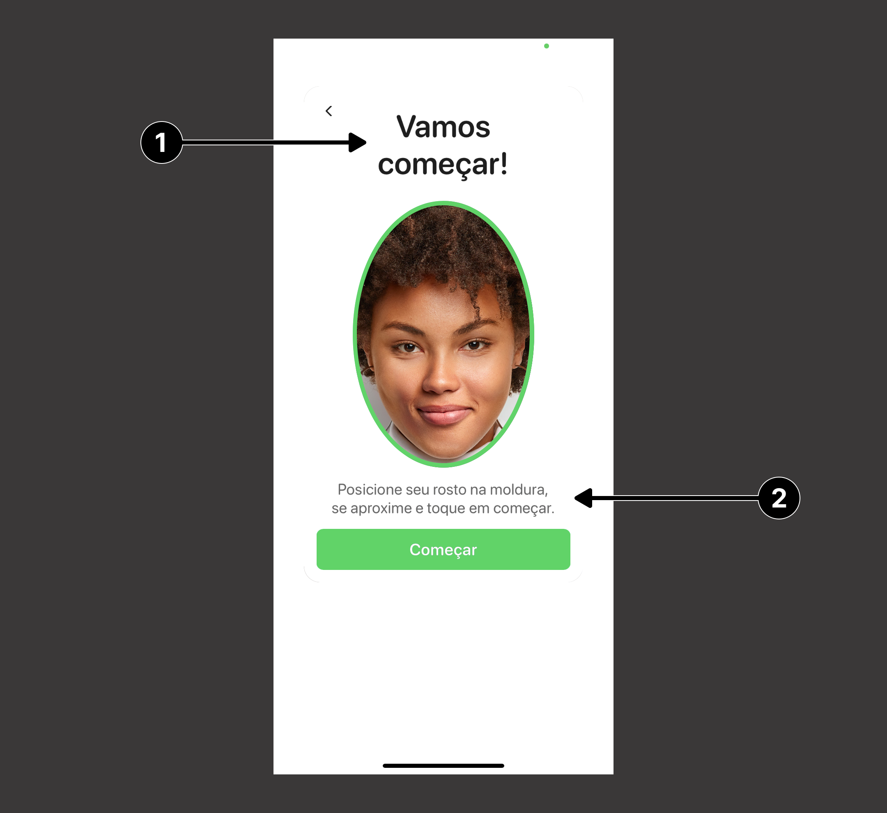

<br/>

### Retry Screen

| **Indice** | **Propriedade** | **Tipo** |
|:-----------|:----------------|:---------|
| (**1**) | guidanceCustomizationRetryScreenHeaderAttributedString | NSAttributedString? |
| (**2**) | guidanceCustomizationRetryScreenSubtextAttributedString | NSAttributedString? |

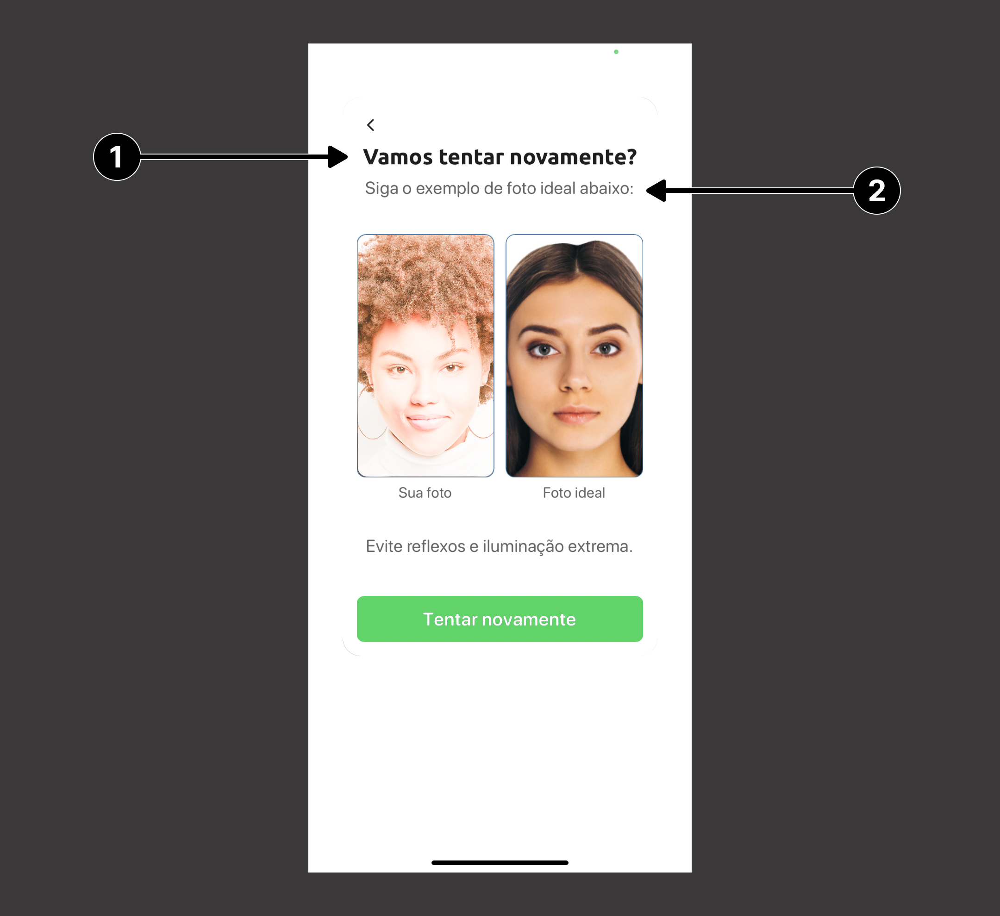

<br/>

### Result Screen

| **Indice** | **Propriedade** | **Tipo** |
|:-----------|:----------------|:---------|
| (**1**) | resultScreenSuccessMessage | String |

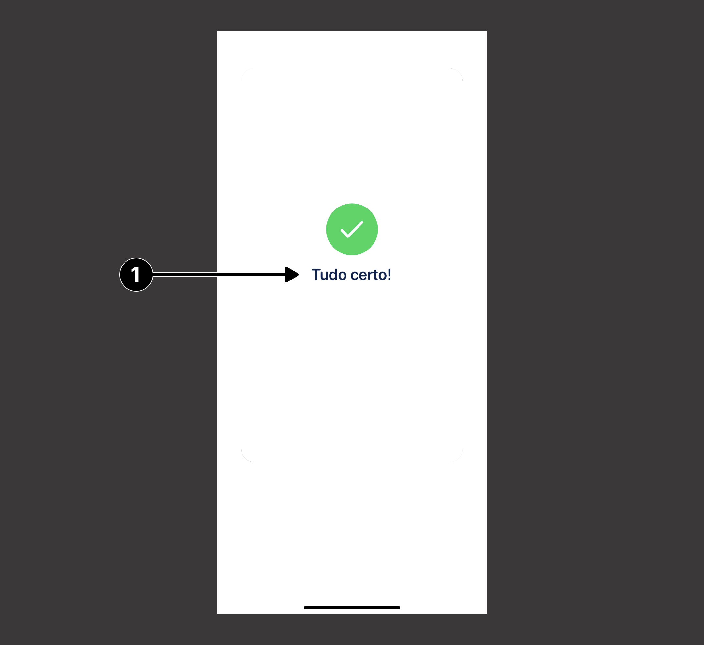

---

## Animação

A animação da tela de resultado pode assumir três valores: `blob`, `spinner()` ou `custom()`, esses valores são atribuídos a propriedade `resultAnimationStyle` do `Liveness3DTheme`. Caso nenhum valor seja atribuído a essa propriedade o valor `spinner()` será aplicado por padrão.

```swift
var theme = Liveness3DTheme(.light)

theme.resultAnimationStyle = .blob
theme.resultAnimationStyle = .spinner(customization)
theme.resultAnimationStyle = .custom(delegate)
```

<br>

### **Blob Animation**

<br>

| **Descrição** | **Animação** | **Customização** |
|:--------------|:-------------|:-----------------|
| Exemplo da <br> Animação | 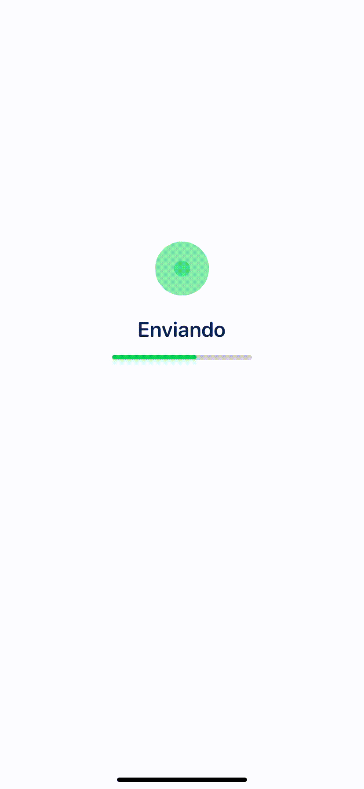 | A customização da animação de Blob é definida <br> pelos parâmetros do `Liveness3DTheme` listados<br>na tabela abaixo:|

<br>

| **Indice** | **Propriedade** | **Tipo** | **Descrição** |
|:-----------|:----------------|:---------|:--------------|
| (**1**) | `resultScreenCustomizationActivityIndicatorColor` | UIColor | Altera a cor do *blob* |
| (**2**) | `resultScreenCustomizationResultAnimationForegroundColor` | UIColor | Altera a cor do *checkmark* ao final<br>da animação de carregamento. |
| (**3**) | `resultScreenCustomizationResultAnimationBackgroundColor` | UIColor | Altera a cor do circulo do *checkmark*<br>ao final da animação de carregamento. |

<br>

### Código de customização

```swift
theme.resultScreenCustomizationActivityIndicatorColor = .blue
theme.resultScreenCustomizationResultAnimationForegroundColor = .systemPink
theme.resultScreenCustomizationResultAnimationBackgroundColor = .yellow
theme.resultAnimationStyle = .blob
```
<br>

### Resultado

<div>
    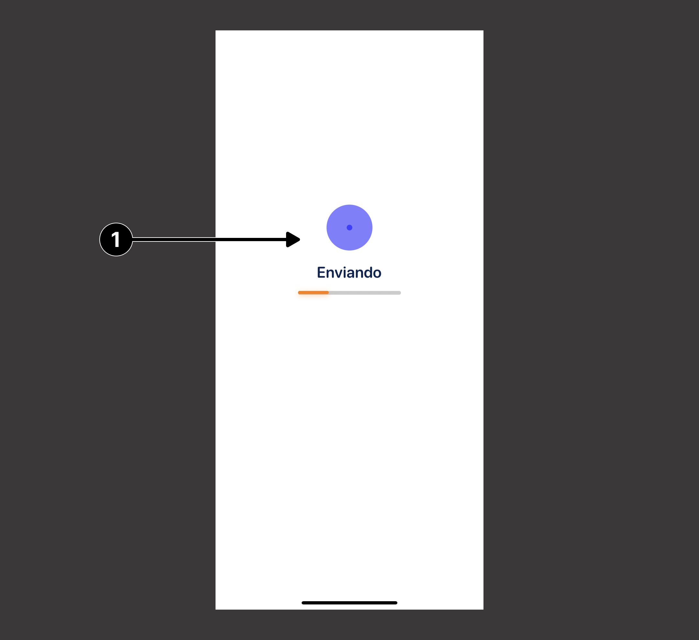
    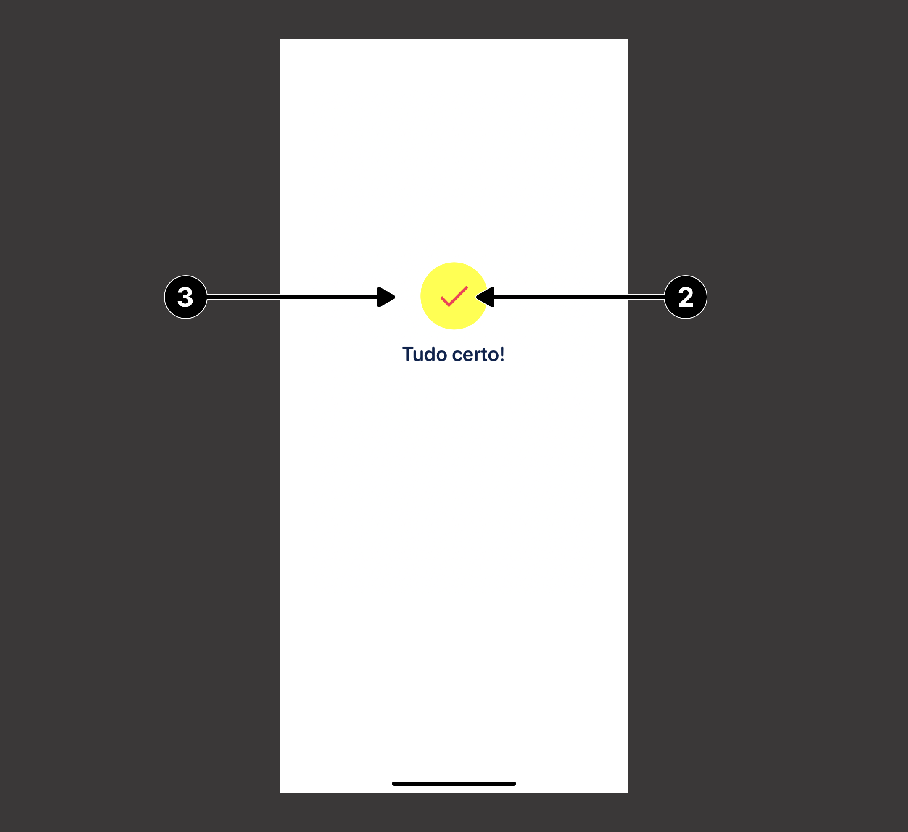
</div>

***
<br>

### **Spinner Animation**
<br>

| **Descrição** | **Animação** | **Customização** |
|:--------------|:-------------|:-----------------|
| Exemplo da <br> Animação | 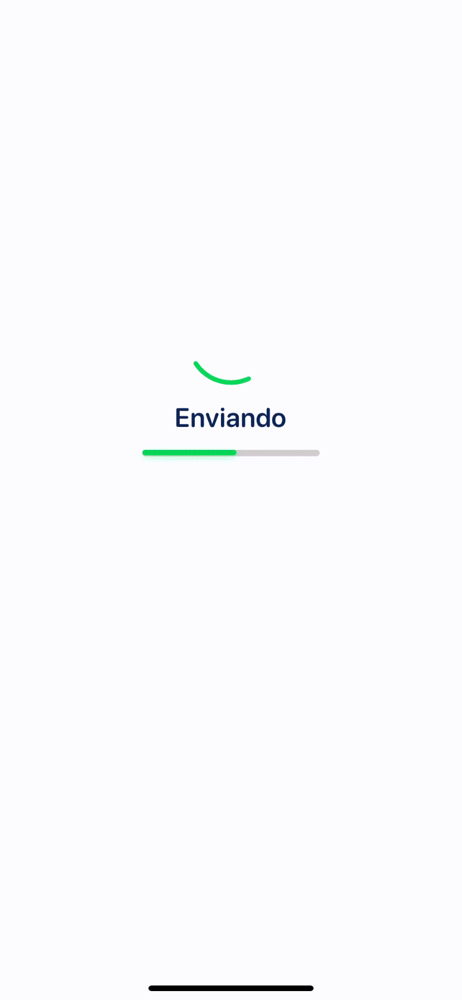 | A customização da animação de Spinner é feita através do<br>objeto do tipo `SpinnerAnimationCustomization`. |

### `SpinnerAnimationCustomization`
| **Indice** | **Propriedade** | **Tipo** | **Descrição** |
|:-----------|:----------------|:---------|:--------------|
| (**1**) | `spinnerColor` | UIColor | Altera a cor do *spinner* |
| (**2**) | `indicatorForegroundColor` | UIColor | Altera a cor do *checkmark* ao final<br>da animação de carregamento. |
| (**3**) | `indicatorBackgroundColor` | UIColor | Altera a cor do circulo do *checkmark*<br>ao final da animação de carregamento. |

<br>

### Código de customização

```swift
let customization = SpinnerAnimationCustomization(
    spinnerColor: .red,
    indicatorForegroundColor: .yellow,
    indicatorBackgroundColor: .blue
)
theme.resultAnimationStyle = .spinner(customization)
```
<br>

### Resultado

<div>
    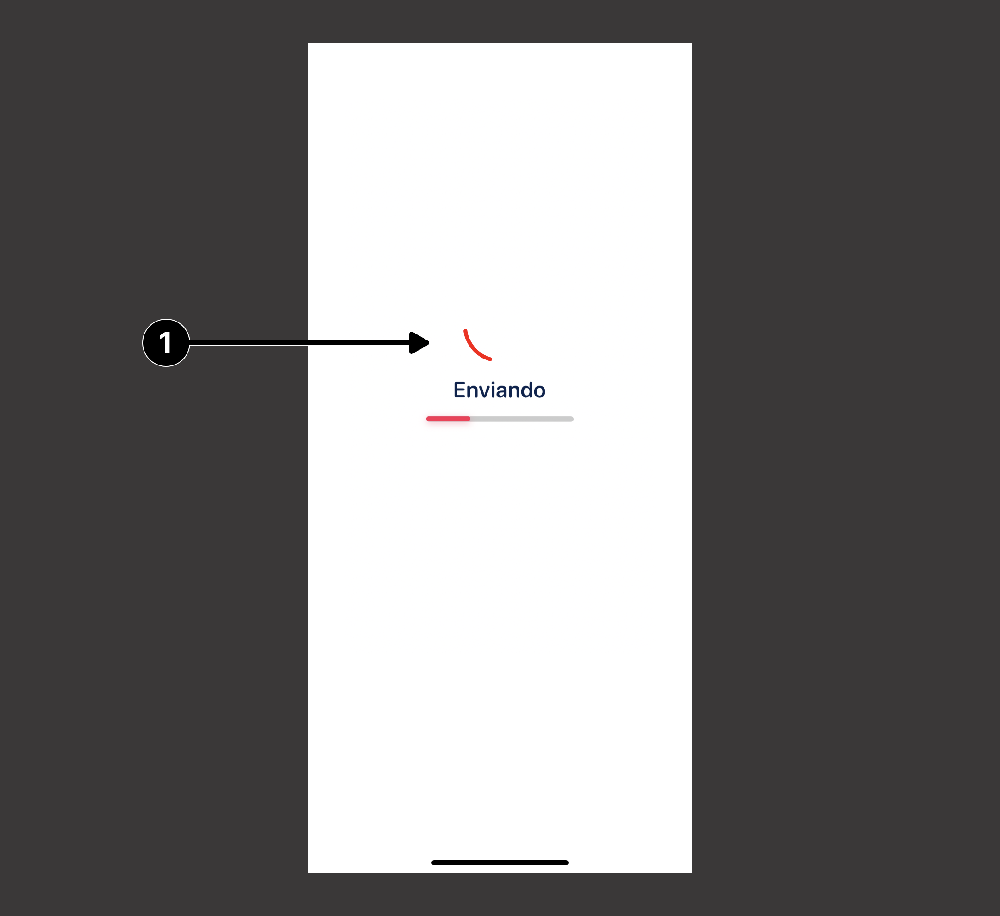
    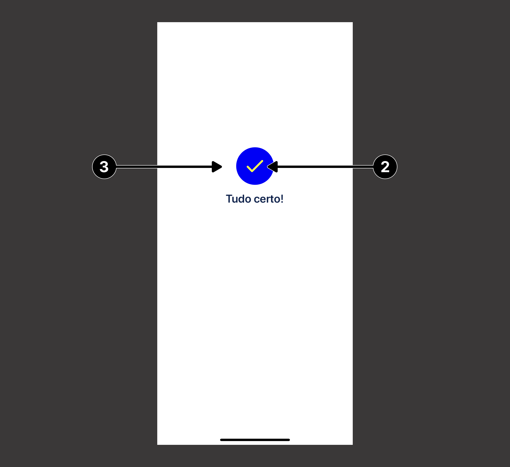
</div>

***

### **Custom Animation**
<br>

| **Descrição** | **Animação** | **Customização** |
|:--------------|:-------------|:-----------------|
| Exemplo da <br> Animação | 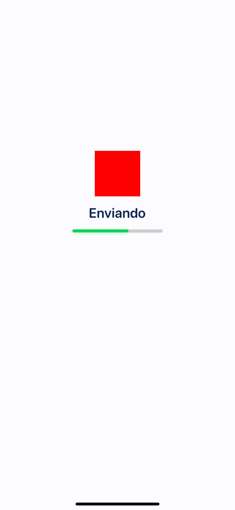 | A animação personalizada é feita através de um<br>objeto que deve estar em conformidade com o<br>protocolo `CustomResultAnimationDelegate`. |

### `CustomResultAnimationDelegate`
| **Indice** | **Método** | **Tipo de retorno** | **Descrição** |
|:-----------|:----------------|:---------|:--------------|
| (**1**) | `createActivityIndicatorView()` | UIView? | Altera a cor do *spinner* |
| (**2**) | `createSuccessAnimationView()` | UIView? | Altera a cor do *checkmark* ao final<br>da animação de carregamento. |

<br>

### Código de customização

```swift
class CustomResultAnimation: CustomResultAnimationDelegate {
    func createActivityIndicatorView() -> UIView? {
        let activityIndicator = UIView()
        activityIndicator.backgroundColor = .red
        return activityIndicator
    }
    
    func createSuccessAnimationView() -> UIView? {
        let successAnimation = UIView()
        successAnimation.backgroundColor = .blue
        return successAnimation
    }
}
```

```swift
theme.resultAnimationStyle = .custom(CustomResultAnimation())
```
<br>

### Resultado

<div>
    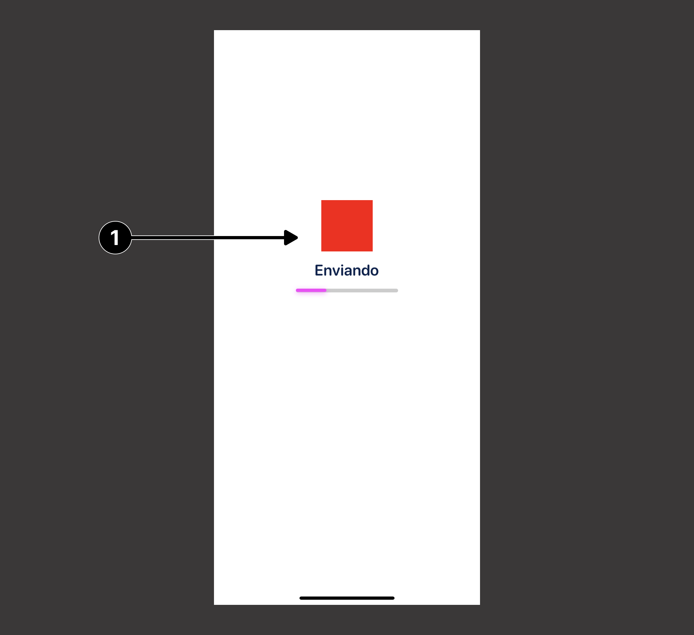
    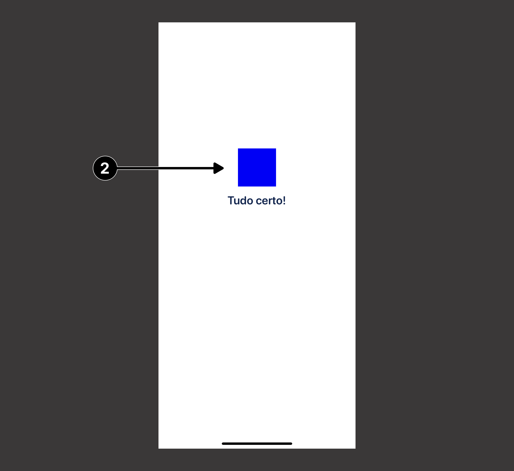
</div>
