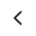

# Guia de Customização do Liveness3DTheme 

A customização do fluxo de prova de vida, dar-se por meio da utilização da `Liveness3DTheme`. Essa classe na sua construção recebe o template padrão, podendo ser DarkTheme ou LightTheme. 
Abaixo, estão mapeadas as propriedades para customização do `Liveness3DTheme`.
 
 
## Tela inicial e atributos globais do fluxo de prova de Vida
 

 &nbsp; &nbsp;

  

| **Atributo** | **Tipo** | **Valor Padrão** | **Descrição** |
|:-------------|:---------|:--------------|:--------------|
| guidanceCustomizationBackgroundColors | [UIColor] | Dark: #000000 Light: #FFFFFF | Define a cor de fundo do fluxo de Prova de vida | 
| guidanceCustomizationForegroundColor | UIColor | Dark: #000000 Light: #FFFFFF |  |
| guidanceCustomizationHeaderFont | UIFont | Ubuntu-Bold | Define a fonte do título |
| guidanceCustomizationSubtextFont | UIFont | Inter-Regular | Define a fonte do subtítulo |
| guidanceCustomizationButtonFont | UIFont | Inter-Bold | Define a fonte do botão que inicia o fluxo |
| guidanceCustomizationButtonTextNormalColor | UIColor | Dark: #FFFFFF Light: #000000 | Define a cor do botão no seu status normal |
| guidanceCustomizationButtonBackgroundNormalColor | UIColor | #05D758 | Define a cor de fundo do botão no status normal |
| guidanceCustomizationButtonTextHighlightColor | UIColor | Dark: #FFFFFF Light: #000000 | Define a cor do foreground |
| guidanceCustomizationButtonBackgroundHighlightColor | UIColor | Dark: #FFFFFF Light: #000000 | Define a cor do foreground |
| guidanceCustomizationButtonTextDisabledColor | UIColor | Dark: #FFFFFF Light: #000000 | Define a cor do label do botão no status desabilitado |
| guidanceCustomizationButtonBackgroundDisabledColor | UIColor | #b4fdd1 | Define a cor de fundo do botão no status desabilitado |
| guidanceCustomizationButtonBorderColor | UIColor | nil | Define a cor da boarda do botão |
| guidanceCustomizationButtonBorderWidth | Int32 | nil | Define a espessura da borda do botão |
| guidanceCustomizationButtonCornerRadius | Int32 | nil | Define o angulo de curvatura nos cantos do botão |
| ovarCustomizationStrokeWidth | Int32 | nil | Define a espessura da borda oval ao lado da captura do rosto |
| ovarCustomizationStrokeColor | UIColor | #05D758 | Define a cor da borda oval ao lado da captura do rosto |
| ovarCustomizationProgressStrokeWidth | UIColor | #05D758 | Define a cor da borda oval ao lado da captura do rosto que se movimenta ao longo da captura |
| ovarCustomizationProgressColor1 | UIColor | #05D758 | Define a cor da borda oval ao lado da captura do rosto que se movimenta ao longo da captura |
| ovarCustomizationProgressColor2 | UIColor | #05D758 | Define a cor da borda oval ao lado da captura do rosto que se movimenta ao longo da captura | 
| ovarCustomizationProgressRadialOffset | Int32 | nil | Define o raio da circunferência |
| frameCustomizationBorderWidth | Int32 | nil | Define a espessura da borda do frame ao redor do círculo oval de leitura facial |
| frameCustomizationCornerRadius | Int32 | nil | Define o angulo de curvatura nos cantos do frame ao redor do círculo oval de leitura facial |
| frameCustomizationBorderColor | UIColor | #05D758 | Define a cor da borda do frame ao redor do círculo oval de leitura facial |
| frameCustomizationBackgroundColor | UIColor | Dark: #000000 Light: #FFFFFF | Define a cor do fundo do frame ao redor do círculo oval de leitura facial |
| frameCustomizationElevation | Int32 | nil | Define o efeito de elevação do frame ao redor do círculo oval de leitura facial |
| overlayCustomizationBackgroundColor | UIColor | Dark: #FFFFFF Light: #000000 | |
| overlayCustomizationBrandingImage | UIImage | nil | Define a logo que irá aparecer no parte inferior da tela durante o fluxo de prova de vida |
| overlayCustomizationShowBrandingImage | Bool | true | Define se a logo deve aparecer |
| feedbackCustomizationCornerRadius | Int32 | nil | Define o angulo de curvatura nos cantos da caixa de texto de feedback para o usuário |  
| feedbackCustomizationBackgroundColors | [UIColor] | Dark: #FFFFFF Light: #000000 | Define a cor de fundo da caixa de texto de feedback para o usuário |
| feedbackCustomizationTextColor | UIColor | Dark: #000000 Light: #000000 | Define a cor do foreground |
| feedbackCustomizationTextFont | UIFont |  | Inter-Regular |
| feedbackCustomizationEnablePulsatingText | UIColor | | | 
| feedbackCustomizationElevation | Int32 | nil | Define o efeito de elevação da caixa de mensagens |
| cancelButtonCustomizationCustomImage | UIImage |   | Define a imagem customizada para o botão cancelar / voltar |
| cancelButtonCustomizationLocation | CancelButtonLocation | topLeft | define a posição do botão cancelar / voltar do fluxo. |

  
## Tela de leitura facial do fluxo de prova de Vida
 

 &nbsp; &nbsp;

  

| **Atributo** | **Tipo** | **Valor Padrão** | **Descrição** |
|:-------------|:---------|:--------------|:--------------|
| guidanceCustomizationReadyScreenHeaderFont | UIFont | Ubuntu-Bold | Define a fonte do título da tela de leitura facial |
| guidanceCustomizationReadyScreenHeaderTextColor | UIColor | | Define a cor do título da tela de leitura facial |
| guidanceCustomizationReadyScreenHeaderAttributedString | NSAttributedString | nil | Define o conteúdo do título da tela de leitura facial, em formato de AttributedString |
| guidanceCustomizationReadyScreenSubtextFont | UIFont | Inter-Regular | Define a fonte do subtítulo da tela de leitura facial |
| guidanceCustomizationReadyScreenSubtextTextColor | UIColor | Dark: #FFFFFF Light: #000000 | Define a cor subtítulo da ela de inicio de captura do fluxo de prova de vida |
| guidanceCustomizationReadyScreenSubtextAttributedString | NSAttributedString | nil | |
| guidanceCustomizationReadyScreenOvarFillColor | UIColor | #05D758 | Define a cor do foreground |
| guidanceCustomizationReadyScreenTextBackgroundColor | UIColor | Dark: #000000 Light: #FFFFFF | Define a cor do background da região do texto|
| guidanceCustomizationReadyScreenTextBackgroundCornerRadius | Int32 | nil | Define o ângulo de curvatura da borda da caixa ao redor do texto

  
## Tela de tentar novament do fluxo de prova de Vida
 

 &nbsp; &nbsp;

  

| **Atributo** | **Tipo** | **Valor Padrão** | **Descrição** |
|:-------------|:---------|:--------------|:--------------|
| guidanceCustomizationRetryScreenHeaderFont | UIFont | Ubuntu-Bold | Define a fonte do título da tela de tentar novamente |
| guidanceCustomizationRetryScreenHeaderTextColor | UIColor | Dark: #FFFFFF Light: #1E1E1E | Define a cor do título da tela de tentar novamente |
| guidanceCustomizationRetryScreenHeaderAttributedString | NSAttributedString | nil | Define o conteúdo para o título da tela de tentar novamente no formato de NSAttributedString |
| guidanceCustomizationRetryScreenSubtextAttributedString | NSAttributedString | nil | Define o conteúdo para o subtítulo da tela de tentar novamente no formato de NSAttributedString |
| guidanceCustomizationRetryScreenSubtextFont | UIFont | Inter-Regular | Define a fonte para o subtítulo da tela de tentar novamente |
| guidanceCustomizationRetryScreenSubtextTextColor | UIColor | Dark: #FFFFFF Light: #666666 | Define a cor para o subtítulo da tela de tentar novamente |
| guidanceCustomizationRetryScreenImageBorderColor | UIColor | #05D758 | Define a cor da borda das imagens de "Foto ideal" e "sua foto" |
| guidanceCustomizationRetryScreenImageBorderWidth | Int32 | nil | Define a espessura da borda das imagens de "Foto ideal" e "sua foto"  |
| guidanceCustomizationRetryScreenImageCornerRadius | Int32 | nil | Define o angulo de curvatura nos cantos da borda das imagens de "Foto ideal" e "sua foto" |
| guidanceCustomizationRetryScreenOvarStrokeColor | UIColor | #05D758 | Define a cor do círculo oval ao redor das das imagens de "Foto ideal" e "sua foto" |

  
## Tela de carregando e resultado do fluxo de prova de Vida
 

 &nbsp; &nbsp;

  

| **Atributo** | **Tipo** | **Valor Padrão** | **Descrição** |
|:-------------|:---------|:--------------|:--------------|
| resultScreenCustomizationAnimationRelativeScale | Int32 | nil | Define a escala do objeto de animação do aguarde. |
| resultScreenCustomizationForegroundColor | UIColor | #05D758 | Define a cor do objeto de animação do aguarde |
| resultScreenCustomizationBackgroundColors | [UIColor] | Dark: [#000000, #000000] Light: [#FFFFFF, #FFFFFF] | Define a cor do background da tela de aguarde e de resultado |
| resultScreenCustomizationActivityIndicatorColor | UIColor | #05D758 | Define a cor do objeto de indicação de progresso da validação |
| resultScreenCustomizationCustomActivityIndicatorImage | UIImage |  | Define a imagem que aparece com o resultado de sucesso da validação da prova de vida |
| resultScreenCustomizationCustomActivityIndicatorRotationIntervar | Int32 | nil | Define o intervalo em que a animação do aguarde deve reiniciar |
| resultScreenCustomizationCustomActivityIndicatorAnimation | UIColor | UIColor(red: 1.00, green: 1.00, blue: 1.00, alpha: 1.00) | Define a cor do foreground |
| resultScreenCustomizationShowUploadProgressBar | Bool | true | Define se a barra de progresso de validação deve ser apresentada |
| resultScreenCustomizationUploadProgressFillColor | UIColor | #05D758 | Define a cor da barra de progresso do carregando do fluxo de prova de vida |
| resultScreenCustomizationUploadProgressTrackColor | UIColor | UIColor | |
| resultScreenCustomizationResultAnimationBackgroundColor | UIColor | Dark: #000000 Light: #FFFFFF | Define a cor de fundo da tela de resultado do fluxo de prova de vida |
| resultScreenCustomizationResultAnimationForegroundColor | UIColor | #05D758 | Define a cor do texto |
| resultScreenCustomizationResultAnimationSuccessBackgroundImage | UIImage | nil | Define a imagem da tela de resultado da operação para caso de sucesso |
| resultScreenCustomizationResultAnimationUnSuccessBackgroundImage | UIImage | nil | Define a imagem da tela de resultado da operação para caso de falha |    
| resultScreenCustomizationCustomResultAnimationSuccess | UIColor | nil | Define a cor do foreground |
| resultScreenCustomizationCustomResultAnimationUnSuccess | UIColor | nil | Define a cor do foreground |
| resultScreenCustomizationCustomStaticResultAnimationSuccess | UIColor | nil | Define a cor do foreground |
| resultScreenCustomizationCustomStaticResultAnimationUnSuccess | UIColor |  |  |
| resultScreenCustomizationMessageFont | UIFont | Inter-Regular | Define a fonte para o o texto da tela de resultado da prova de vida |