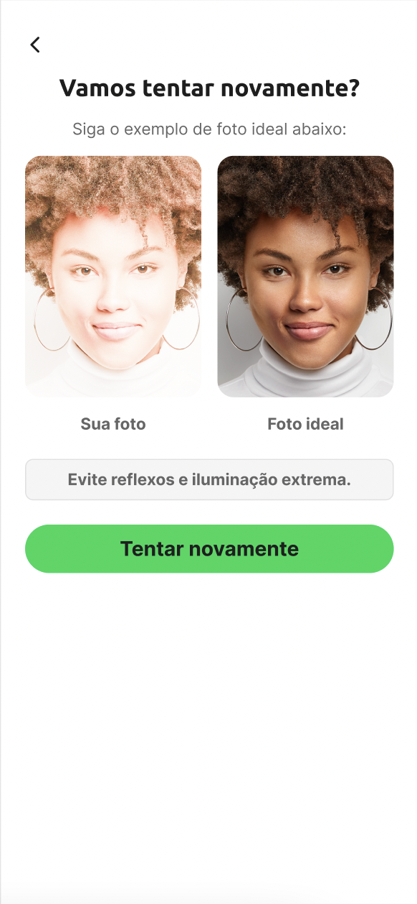

# Guia de Customização do Liveness3DTheme 

A customização do fluxo de prova de vida, dar-se por meio da utilização da `Liveness3DTheme`. Essa classe na sua construção recebe o template padrão, podendo ser DarkTheme ou LightTheme. 
Abaixo, estão mapeadas as propriedades para customização do `Liveness3DTheme`.
 
 
## Tela inicial e atributos globais do fluxo de prova de Vida
 

 &nbsp; &nbsp;

  

| **Atributo** | **Tipo** | **Valor Padrão** | **Descrição** |
|:-------------|:---------|:--------------|:--------------|
| guidanceCustomizationBackgroundColors | [UIColor] | Dark: #000000 Light: #FFFFFF | Define a cor de fundo do fluxo de Prova de vida | 
| guidanceCustomizationForegroundColor | UIColor | Dark: #000000 Light: #FFFFFF |  |
| guidanceCustomizationHeaderFont | UIFont | Ubuntu-Bold | Define a fonte do título |
| guidanceCustomizationSubtextFont | UIFont | Inter-Regular | Define a fonte do subtítulo |
| guidanceCustomizationRetryScreenSubtextAttributedString | NSAttributedString | nil | Define o texto do subtitulo no formato de um attributedString. |
| guidanceCustomizationButtonFont | UIFont | Inter-Bold | Define a fonte do botão que inicia o fluxo |
| guidanceCustomizationButtonTextNormalColor | UIColor | Dark: #000000 Light: #FFFFFF | Define a cor do botão no seu status normal |
| guidanceCustomizationButtonBackgroundNormalColor | UIColor | #05D758 | Define a cor de fundo do botão no status normal |
| guidanceCustomizationButtonTextHighlightColor | UIColor | Dark: #FFFFFF Light: #000000 | Define a cor do foreground |
| guidanceCustomizationButtonBackgroundHighlightColor | UIColor | Dark: #FFFFFF Light: #000000 | Define a cor do foreground |
| guidanceCustomizationButtonTextDisabledColor | UIColor | Dark: #FFFFFF Light: #000000 | Define a cor do label do botão no status desabilitado |
| guidanceCustomizationButtonBackgroundDisabledColor | UIColor | #b4fdd1 | Define a cor de fundo do botão no status desabilitado |
| guidanceCustomizationButtonBorderColor | UIColor | nil | Define a cor da boarda do botão |
| guidanceCustomizationButtonBorderWidth | Int32 | nil | Define a espessura da borda do botão |
| guidanceCustomizationButtonCornerRadius | Int32 | nil | Define o angulo de curvatura nos cantos do botão |
| ovarCustomizationStrokeWidth | Int32 | nil | Define a espessura da borda oval ao lado da captura do rosto |
| ovarCustomizationStrokeColor | UIColor | #05D758 | Define a cor da borda oval ao lado da captura do rosto |
| ovarCustomizationProgressStrokeWidth | UIColor | #05D758 | Define a cor da borda oval ao lado da captura do rosto que se movimenta ao longo da captura |
| ovarCustomizationProgressColor1 | UIColor | #05D758 | Define a cor do foreground |
| ovarCustomizationProgressColor2 | UIColor | #05D758 | Define a cor do foreground | 
| ovarCustomizationProgressRadialOffset | Int32 | nil | Define a cor do foreground |
| frameCustomizationBorderWidth | Int32 | nil | Define a espessura da borda do frame ao redor do círculo oval de leitura facial |
| frameCustomizationCornerRadius | Int32 | nil | Define o angulo de curvatura nos cantos do frame ao redor do círculo oval de leitura facial |
| frameCustomizationBorderColor | UIColor | #05D758 | Define a cor da borda do frame ao redor do círculo oval de leitura facial |
| frameCustomizationBackgroundColor | UIColor | Dark: #000000 Light: #FFFFFF | Define a cor do fundo do frame ao redor do círculo oval de leitura facial |
| frameCustomizationElevation | Int32 | nil | Define o efeito de elevação do frame ao redor do círculo oval de leitura facial |
| overlayCustomizationBackgroundColor | UIColor | UIColor(red: 1.00, green: 1.00, blue: 1.00, alpha: 1.00) | Define a cor do foreground |
| overlayCustomizationBrandingImage | UIColor | UIColor(red: 1.00, green: 1.00, blue: 1.00, alpha: 1.00) | Define a cor do foreground |
| overlayCustomizationShowBrandingImage | UIColor | UIColor(red: 1.00, green: 1.00, blue: 1.00, alpha: 1.00) | Define a cor do foreground |
| feedbackCustomizationCornerRadius | UIColor | UIColor(red: 1.00, green: 1.00, blue: 1.00, alpha: 1.00) | Define a cor do foreground |  
| feedbackCustomizationBackgroundColors | UIColor | UIColor(red: 1.00, green: 1.00, blue: 1.00, alpha: 1.00) | Define a cor do foreground |
| feedbackCustomizationTextColor | UIColor | UIColor(red: 1.00, green: 1.00, blue: 1.00, alpha: 1.00) | Define a cor do foreground |
| feedbackCustomizationTextFont | UIColor | UIColor(red: 1.00, green: 1.00, blue: 1.00, alpha: 1.00) | Define a cor do foreground |
| feedbackCustomizationEnablePulsatingText | UIColor | UIColor(red: 1.00, green: 1.00, blue: 1.00, alpha: 1.00) | Define a cor do foreground | 
| feedbackCustomizationElevation | Int32 | nil | Define o efeito de elevação da caixa de mensagens |
| cancelButtonCustomizationCustomImage | UIImage |   | Define a imagem customizada para o botão cancelar / voltar |
| cancelButtonCustomizationLocation | CancelButtonLocation | topLeft | define a posição do botão cancelar / voltar do fluxo. |

  
## Tela de leitura facial do fluxo de prova de Vida
 
 &nbsp; &nbsp;

  

| **Atributo** | **Tipo** | **Valor Padrão** | **Descrição** |
|:-------------|:---------|:--------------|:--------------|
| guidanceCustomizationReadyScreenHeaderFont | UIFont | Ubuntu-Bold | Define a fonte do título da tela de leitura facial |
| guidanceCustomizationReadyScreenHeaderTextColor | UIColor | | Define a cor do título da tela de leitura facial |
| guidanceCustomizationReadyScreenHeaderAttributedString | NSAttributedString | nil | Define o conteúdo do título da tela de leitura facial, em formato de AttributedString |
| guidanceCustomizationReadyScreenSubtextFont | UIFont | Inter-Regular | Define a fonte do subtítulo da tela de leitura facial |
| guidanceCustomizationReadyScreenSubtextTextColor | UIColor | Dark: #FFFFFF Light: #000000 | Define a cor subtítulo da ela de inicio de captura do fluxo de prova de vida |
| guidanceCustomizationReadyScreenSubtextAttributedString | NSAttributedString | nil | |
| guidanceCustomizationReadyScreenOvarFillColor | UIColor | #05D758 | Define a cor do foreground |
| guidanceCustomizationReadyScreenTextBackgroundColor | UIColor | UIColor(red: 1.00, green: 1.00, blue: 1.00, alpha: 1.00) | Define a cor do foreground |
| guidanceCustomizationReadyScreenTextBackgroundCornerRadius | Int32 | UIColor(red: 1.00, green: 1.00, blue: 1.00, alpha: 1.00) | Define a cor do foreground |

  
## Tela de tentar novament do fluxo de prova de Vida
 
 &nbsp; &nbsp;

  

| **Atributo** | **Tipo** | **Valor Padrão** | **Descrição** |
|:-------------|:---------|:--------------|:--------------|
| guidanceCustomizationRetryScreenHeaderFont | UIFont | Ubuntu-Bold | Define a cor do foreground |
| guidanceCustomizationRetryScreenHeaderTextColor | UIColor | Dark: #FFFFFF Light: #1E1E1E | Define a cor do foreground |
| guidanceCustomizationRetryScreenHeaderAttributedString | NSAttributedString | nil | |
| guidanceCustomizationRetryScreenSubtextFont | UIFont | Inter-Regular | Define a cor do foreground |
| guidanceCustomizationRetryScreenSubtextTextColor | UIColor | Dark: #FFFFFF Light: #666666 | Define a cor do foreground |
| guidanceCustomizationRetryScreenImageBorderColor | UIColor | UIColor(red: 1.00, green: 1.00, blue: 1.00, alpha: 1.00) | Define a cor do foreground |
| guidanceCustomizationRetryScreenImageBorderWidth | Int32 | UIColor(red: 1.00, green: 1.00, blue: 1.00, alpha: 1.00) | Define a cor do foreground |
| guidanceCustomizationRetryScreenImageCornerRadius | Int32 | UIColor(red: 1.00, green: 1.00, blue: 1.00, alpha: 1.00) | Define a cor do foreground |
| guidanceCustomizationRetryScreenOvarStrokeColor | UIColor | UIColor(red: 1.00, green: 1.00, blue: 1.00, alpha: 1.00) | Define a cor do foreground |

  
## Tela de carregando e resultado do fluxo de prova de Vida
 
 &nbsp; &nbsp;
 &nbsp; &nbsp;
  

| **Atributo** | **Tipo** | **Valor Padrão** | **Descrição** |
|:-------------|:---------|:--------------|:--------------|
| resultScreenCustomizationAnimationRelativeScale | Int32 | UIColor(red: 1.00, green: 1.00, blue: 1.00, alpha: 1.00) | Define a cor do foreground |
| resultScreenCustomizationForegroundColor | UIColor | UIColor(red: 1.00, green: 1.00, blue: 1.00, alpha: 1.00) | Define a cor do foreground |
| resultScreenCustomizationBackgroundColors | [UIColor] | UIColor(red: 1.00, green: 1.00, blue: 1.00, alpha: 1.00) | Define a cor do foreground |
| resultScreenCustomizationActivityIndicatorColor | UIColor | UIColor(red: 1.00, green: 1.00, blue: 1.00, alpha: 1.00) | Define a cor do foreground |
| resultScreenCustomizationCustomActivityIndicatorImage | UIImage | UIColor(red: 1.00, green: 1.00, blue: 1.00, alpha: 1.00) | Define a cor do foreground |
| resultScreenCustomizationCustomActivityIndicatorRotationIntervar | INT32 | UIColor(red: 1.00, green: 1.00, blue: 1.00, alpha: 1.00) | Define a cor do foreground |
| resultScreenCustomizationCustomActivityIndicatorAnimation | UIColor | UIColor(red: 1.00, green: 1.00, blue: 1.00, alpha: 1.00) | Define a cor do foreground |
| resultScreenCustomizationShowUploadProgressBar | UIColor | UIColor(red: 1.00, green: 1.00, blue: 1.00, alpha: 1.00) | Define a cor do foreground |
| resultScreenCustomizationUploadProgressFillColor | UIColor | UIColor(red: 1.00, green: 1.00, blue: 1.00, alpha: 1.00) | Define a cor do foreground |
| resultScreenCustomizationUploadProgressTrackColor | UIColor | UIColor(red: 1.00, green: 1.00, blue: 1.00, alpha: 1.00) | Define a cor do foreground |
| resultScreenCustomizationResultAnimationBackgroundColor | UIColor | UIColor(red: 1.00, green: 1.00, blue: 1.00, alpha: 1.00) | Define a cor do foreground |
| resultScreenCustomizationResultAnimationForegroundColor | UIColor | UIColor(red: 1.00, green: 1.00, blue: 1.00, alpha: 1.00) | Define a cor do foreground |
| resultScreenCustomizationResultAnimationSuccessBackgroundImage | UIColor | UIColor(red: 1.00, green: 1.00, blue: 1.00, alpha: 1.00) | Define a cor do foreground |
| resultScreenCustomizationResultAnimationUnSuccessBackgroundImage | UIColor | UIColor(red: 1.00, green: 1.00, blue: 1.00, alpha: 1.00) | Define a cor do foreground |    
| resultScreenCustomizationCustomResultAnimationSuccess | UIColor | UIColor(red: 1.00, green: 1.00, blue: 1.00, alpha: 1.00) | Define a cor do foreground |
| resultScreenCustomizationCustomResultAnimationUnSuccess | UIColor | UIColor(red: 1.00, green: 1.00, blue: 1.00, alpha: 1.00) | Define a cor do foreground |
| resultScreenCustomizationCustomStaticResultAnimationSuccess | UIColor | UIColor(red: 1.00, green: 1.00, blue: 1.00, alpha: 1.00) | Define a cor do foreground |
| resultScreenCustomizationCustomStaticResultAnimationUnSuccess | UIColor | UIColor(red: 1.00, green: 1.00, blue: 1.00, alpha: 1.00) | Define a cor do foreground |
| resultScreenCustomizationMessageFont | UIColor | UIColor(red: 1.00, green: 1.00, blue: 1.00, alpha: 1.00) | Define a cor do foreground |