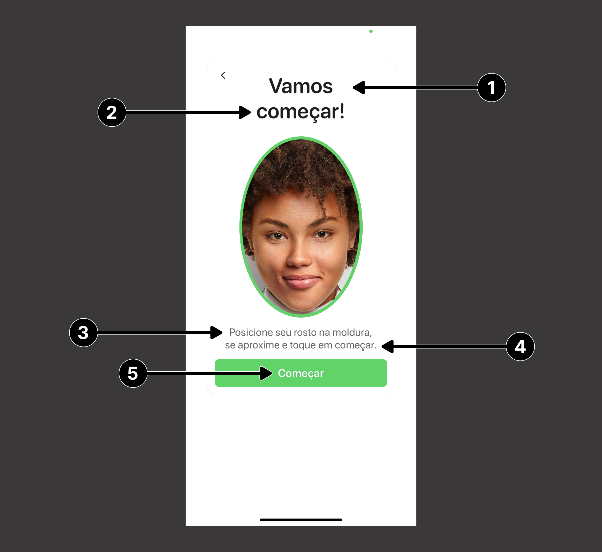
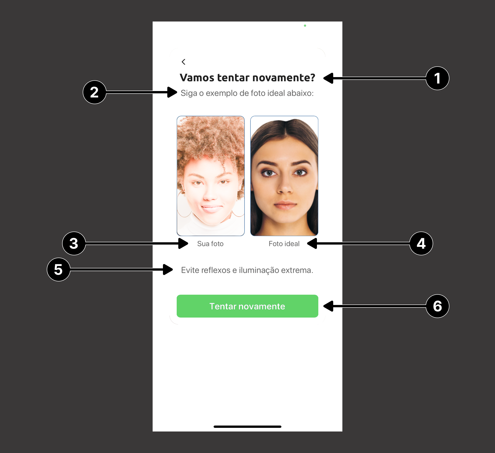
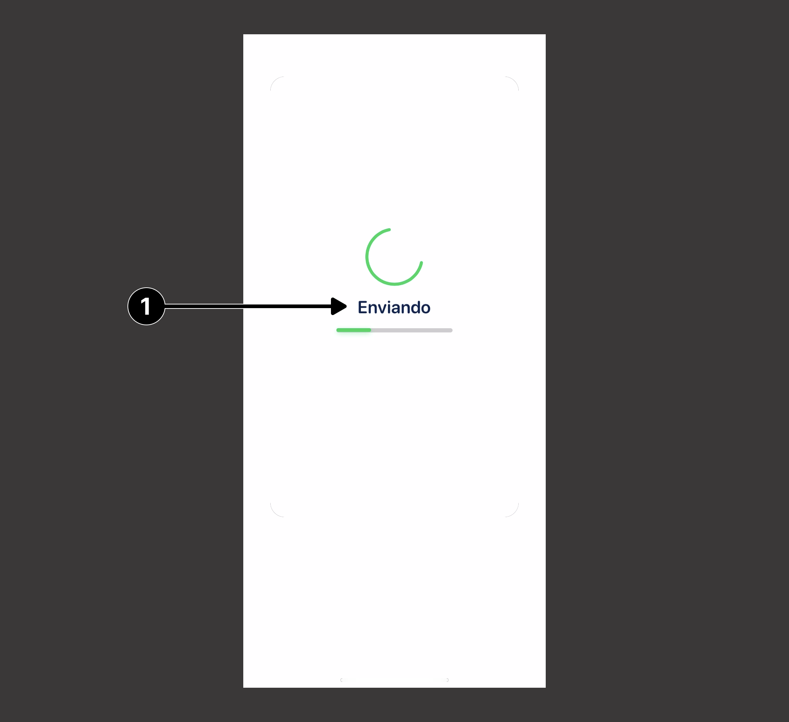
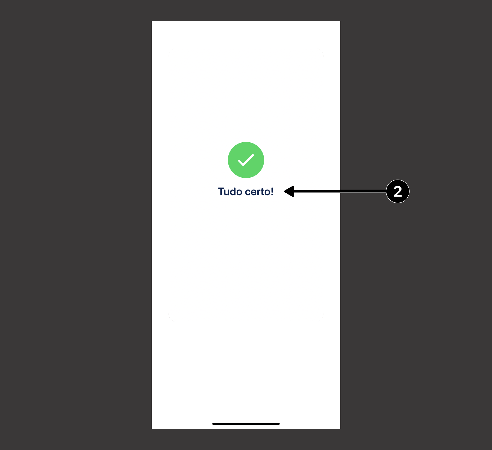
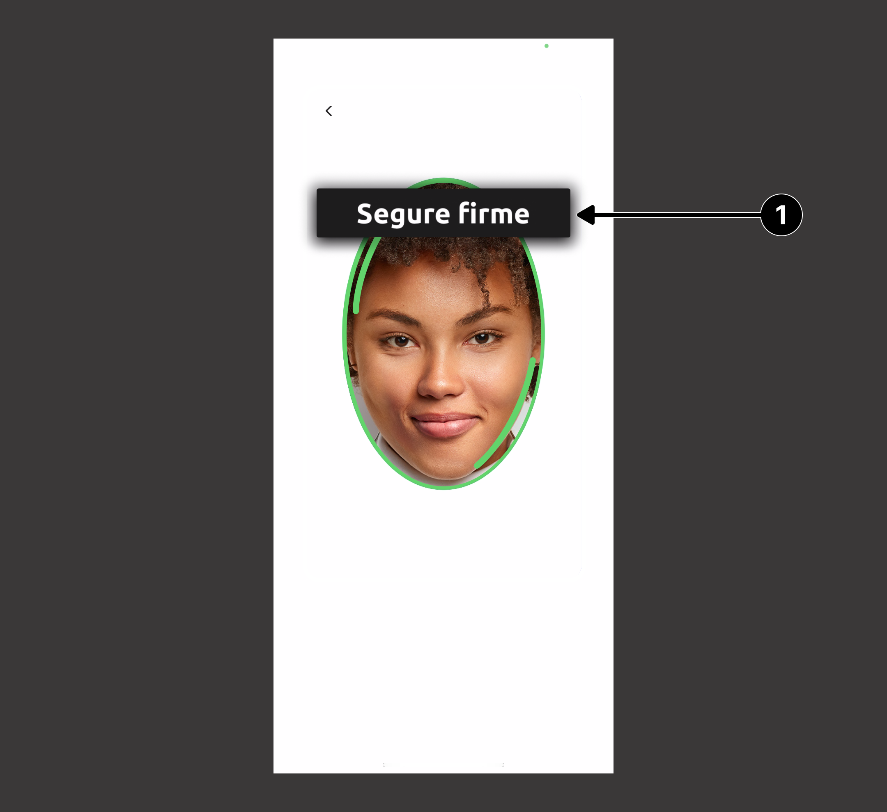

# Guia de Customização: Textos
Os textos do fluxo do Liveness3D podem ser alterados passando como argumento para o parâmetro de **texts** do ``Liveness3DUser`` 
um dicionário que possui como chave o *enum* ``Liveness3DTextKey`` e um valor do tipo `String`.

### Exemplo de utilização
```swift
let liveness3DTexts: [Liveness3DTextKey: String] = [
    .readyHeader1: "Vamos",
    .readyHeader2: "começar!" 
]

let liveness3DUser = Liveness3DUser(
    appKey: appKey,
    environment: .HML,
    texts: liveness3DTexts
)
```

> ⚠️ **IMPORTANTE**
>
> Não é necessário fornecer todos os valores para o dicionário, somente aqueles que possuem necessidade de alteração.

---

### Ready Screen

| **Indice** | **Chave**     | **Valor padrão**                  |
| :--------- | :------------ | :-------------------------------- |
| (**1**)    | readyHeader1  | "Vamos"                           |
| (**2**)    | readyHeader2  | "começar!"                        |
| (**3**)    | readyMessage1 | "Posicione seu rosto na moldura," |
| (**4**)    | readyMessage2 | "se aproxime e toque em começar"  |
| (**5**)    | readyButton   | "Começar"                         |



---

### Retry Screen

| **Indice** | **Chave**             | **Valor padrão**                       |
| :--------- | :-------------------- | :------------------------------------- |
| (**1**)    | retryHeader           | "Vamos tentar novamente?"              |
| (**2**)    | retrySubheader        | "Siga o exemplo de foto ideal abaixo:" |
| (**3**)    | retryYourPicture      | "Sua foto"                             |
| (**4**)    | retryIdealPicture     | "Foto ideal"                           |
| (**5**)    | retryMessageSmile     | "Não sorria"                           |
| (**5**)    | retryMessageLightning | "Evite reflexos e iluminação extrema"  |
| (**5**)    | retryMessageContrast  | "Precisamos de uma foto nítida"        |
| (**6**)    | retryButton           | "Tentar novamente"                     |



---

### Result Screen

| **Indice** | **Chave**            | **Valor padrão** |
| :--------- | :------------------- | :--------------- |
| (**1**)    | resultUploadMessage  | "Enviando"       |
| (**2**)    | resultSuccessMessage | "Tudo certo!"    |

<div>
    
    
<div/>

---

### Feedback

| **Indice** | **Chave**                           | **Valor padrão**                         |
| :--------- | :---------------------------------- | :--------------------------------------- |
| (**1**)    | feedbackCenterFace                  | "Centralize seu rosto"                   |
| (**1**)    | feedbackFaceNotFound                | "Posicione seu rosto"                    |
| (**1**)    | feedbackFaceNotLookingStraightAhead | "Olhe para frente"                       |
| (**1**)    | feedbackFaceNotUpright              | "Mantenha a cabeça reta"                 |
| (**1**)    | feedbackHoldSteady                  | "Segure firme"                           |
| (**1**)    | feedbackMovePhoneAway               | "Afaste-se"                              |
| (**1**)    | feedbackMovePhoneCloser             | "Aproxime-se"                            |
| (**1**)    | feedbackMovePhoneToEyeLevel         | "Mantenha o telefone ao nível dos olhos" |
| (**1**)    | feedbackUseEvenLighting             | "Encontre um ambiente iluminado"         |
| (**1**)    | feedbackFrameYourFace               | "Vamos começar"                          |
| (**1**)    | feedbackPositionFaceStraightInOval  | "Olhe para frente"                       |
| (**1**)    | feedbackHoldSteady1                 | "Segure firme por: 1"                    |
| (**1**)    | feedbackHoldSteady2                 | "Segure firme por: 2"                    |
| (**1**)    | feedbackHoldSteady3                 | "Segure firme por: 3"                    |
| (**1**)    | feedbackEyesStraightAhead           | "Olhe para frente"                       |
| (**1**)    | feedbackRemoveDarkGlasses           | "Remova seus óculos escuros"             |
| (**1**)    | feedbackNeutralExpression           | "Olhe para a câmera sem sorrir"          |
| (**1**)    | feedbackConditionsTooBright         | "Evite um ambiente muito iluminado"      |
| (**1**)    | feedbackBrightenYourEnvironment     | "Encontre um ambiente bem iluminado"     |


