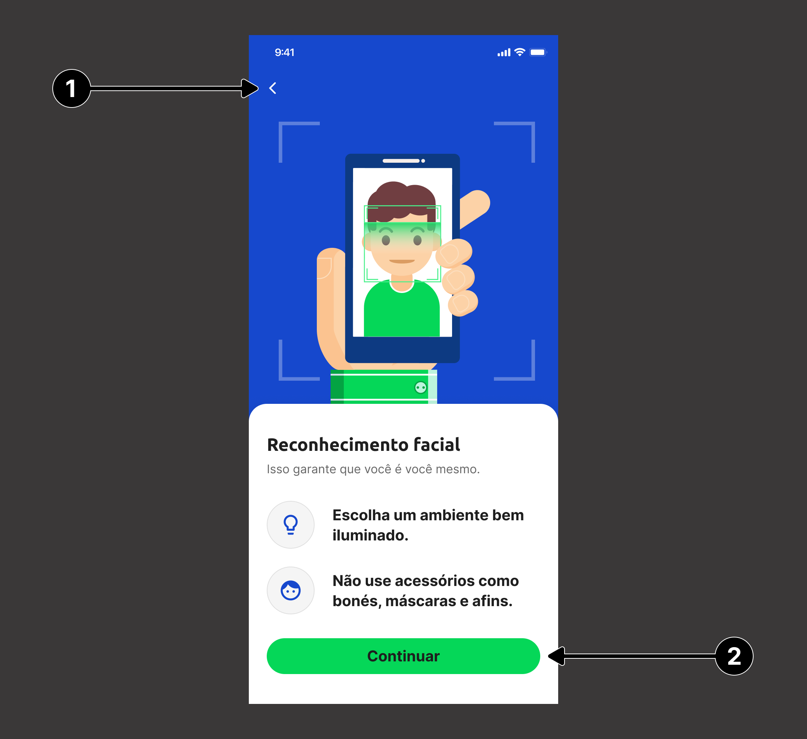

# Guia de Customização: Views

Além de poder usar o SDK em sua forma padrão de exibição, o SDK permite que a forma de visualização das telas de instrução para execução do Liveness 3D e permissão de câmera seja completamente customizada.

A customização do visual é feita através da implementação de *views* que devem implementar os protocolos definidos para cada tela.

Para integrar as *views* customizadas ao fluxo de telas do SDK, as customizações devem ser passadas como argumentos para os parâmetros **customInstructionView** e **customPermissionView** do `Liveness3DViewController`:

```swift
let viewController = Liveness3DViewController(
    liveness3DUser: liveness3DUser,
    customInstructionView: CustomInstructionView(),
    customPermissionView: CustomCameraPermissionView()
)
```

## Tela de Instruções

Para customizar a tela de instrução é necessário a criação de uma `UIView` (via código ou via Interface Builder), que implemente o protocolo `CustomInstructionView` como demonstrado abaixo:

```swift
public protocol CustomInstructionView: UIView {  
    var backButton: UIButton! { get }
    var continueButton: UIButton! { get }
    
    func changeLoadingVisibility(to visibility: LoadingVisibility)
}
```

| **Indice** | **Elemento**                   | **Descrição**                                                               |
| :--------- | :----------------------------- | :-------------------------------------------------------------------------- |
| (**1**)    | `backButton`                   | Botão de voltar no fluxo de navegação.                                      |
| (**2**)    | `continueButton`               | Botão para iniciar o processo do Liveness 3D.                               |
|            | `changeLoadingVisibility(to:)` | Método responsável por indicar o estado do *loading* na tela de instruções, podendo receber dois valores: **hidden** (esconder o loading) e **displayed** (mostrar o loading). |

<br/>


***

## Tela de Permissão de Câmera

Para customizar a tela de permissão de câmera é necessário a criação de uma `UIView` (via código ou via Interface Builder), que implemente o protocolo `CustomCameraPermissionView` como demonstrado abaixo:

```swift
public protocol CustomCameraPermissionView: UIView {
    var backButton: UIButton! { get }
    var checkPermissionButton: UIButton! { get }
    var openSettingsButton: UIButton! { get }
    var closeButton: UIButton! { get }

    func showBottomSheet(visibility: Visibility)
}
```

| **Indice** | **Elemento**                   | **Descrição**                                                                                            |
| :--------- | :----------------------------- | :------------------------------------------------------------------------------------------------------- |
| (**1**)    | `backButton`                   | Botão para função voltar da navegação.                                                                   |
| (**2**)    | `checkPermissionButton`        | Botão responsável por verificar a permissão de câmera e solicitá-la se necessário.                       |
| (**3**)    | `openSettingsButton`           | Botão que redireciona o usuário para o menu de permissões do aplicativo na configurações do dispositivo. |
| (**4**)    | `closeButton`                  | Botão que fechar o fluxo de validação da permissão de câmera e volta para tela anterior.                 |
|            | `showBottomSheet(visibility:)` | Método responsável por indicar o momento de mostrar os botões de `openSettingsButton` e `closeButton`, podendo receber dois valores: **hidden** (esconder o loading) e **displayed** (mostrar o loading). |

<br/>
<div>
    
    
<div/>

> **Notas**: 
> 1. Além das subviews especificadas, as views customizadas pode conter outros elementos, apenas tomando cuidado para que os mesmos não interfiram nas subviews funcionais;<br/>
> 2. No projeto Sample, neste mesmo repositório, encontra-se um exemplo de implementação.