# Guia de Customização: Liveness3DTheme 

A customização do fluxo de prova de vida, dar-se por meio da utilização da `Liveness3DTheme`. Essa classe na sua construção recebe o template padrão, podendo ser DarkTheme ou LightTheme. Os temas são atribuídos aos argumentos `defaultTheme` e `lowLightTheme` do ``Liveness3DUser``.<br>

```swift
var defaultTheme = Liveness3DTheme(.dark)
defaultTheme.cancelButtonCustomizationLocation = .left

var lowLightTheme = Liveness3DTheme(.light)
lowLightTheme.cancelButtonCustomizationLocation = .left

let liveness3DUser = Liveness3DUser(
    appKey: appKey,
    environment: .HML,
    defaultTheme: defaultTheme,
    lowLightTheme: lowLightTheme
)
```
> **Considerações**: <br/>
> 1. Ambos os temas serão aplicados de acordo com o funcionamento interno do SDK, onde o tema padrão (*defaultTheme*) será utilizado até que haja a necessidade de utilizar o tema para pouco luminosidade (*lowLightTheme*).
> 2. Todos as propriedades do `Liveness3DTheme` possuem um valor *default*, dessa forma, não é necessário especificar todas as propriedades para exibir a customização.

Abaixo, estão mapeadas as propriedades para customização do `Liveness3DTheme`.

## Elementos comuns

### 1. Botão de cancelar
| **Atributo**                         | **Tipo**             | **Descrição**                                                              |
| :----------------------------------- | :------------------- | :------------------------------------------------------------------------- |
| cancelButtonCustomizationCustomImage | UIImage              | Cancela a operação e retorna para view anterior.                           |
| cancelButtonCustomizationLocation    | CancelButtonLocation | Enum que determina a posição do botão. Esquerda, deireita ou desabilitado. |

```swift
public enum CancelButtonLocation: Int {
    case topLeft = 0
    case topRight = 1
    case disabled = 2
}
```

### 2. Frame
| **Atributo**                      | **Tipo** | **Descrição**                                             |
| :-------------------------------- | :------- | :-------------------------------------------------------- |
| frameCustomizationBorderWidth     | Int32?   | Modifica a largura da borda do frame.                     |
| frameCustomizationCornerRadius    | Int32    | Modifica o tamanho do arredondamento das bordas do frame. |
| frameCustomizationBorderColor     | UIColor? | Modifica a cor da borda do frame.                         |
| frameCustomizationBackgroundColor | UIColor? | Modifica a cor de fundo do frame.                         |

### 3. Overlay
| **Atributo**                          | **Tipo** | **Descrição**                                                        |
| :------------------------------------ | :------- | :------------------------------------------------------------------- |
| overlayCustomizationBackgroundColor   | UIColor? | Modifica a cor de fundo da camada de overlay.                        |
| overlayCustomizationBrandingImage     | UIImage? | Adiciona uma imagem na camada de overlay.                            |
| overlayCustomizationShowBrandingImage | Bool     | Propriedade booleana que ativa a visualização da imagem customizada. |

### 4 .Feedback Bar
| **Atributo**                             | **Tipo**         | **Descrição**                                             |
| :--------------------------------------- | :--------------- | :-------------------------------------------------------- |
| feedbackCustomizationCornerRadius        | Int32?           | Modifica o tamanho do arredondamento das bordas da barra. |
| feedbackCustomizationBackgroundColor     | CAGradientLayer? | Modifica a cor de fundo da barra.                         |
| feedbackCustomizationTextColor           | UIColor?         | Modifica a cor do texto do feedback.                      |
| feedbackCustomizationTextFont            | UIFont?          | Adiciona uma fonte customizada para o texto do feedback.  |
| feedbackCustomizationEnablePulsatingText | Bool             | ***                                                       |

### 5. Oval
| **Atributo**                          | **Tipo** | **Descrição**                                                   |
| :------------------------------------ | :------- | :-------------------------------------------------------------- |
| ovarCustomizationStrokeWidth          | Int32?   | Modifica a largura da borda da camada oval.                     |
| ovarCustomizationStrokeColor          | UIColor  | Modifica a cor da borda da camada oval.                         |
| ovarCustomizationProgressStrokeWidth  | Int32?   | Modifica a largura da borda do progresso da camada oval.        |
| ovarCustomizationProgressColor1       | UIColor  | Modifica a cor da borda de progresso da camada oval.            |
| ovarCustomizationProgressColor2       | UIColor  | Modifica a cor da borda de progresso da camada oval.            |
| ovarCustomizationProgressRadialOffset | Int32?   | Modifica o distânciamento da borda de progresso da camada oval. |

### 6. Botões
| **Atributo**                                        | **Tipo** | **Descrição**                                                     |
| :-------------------------------------------------- | :------- | :---------------------------------------------------------------- |
| guidanceCustomizationButtonFont                     | UIFont?  | Adiciona uma fonte customizada para o texto do botão.             |
| guidanceCustomizationButtonTextNormalColor          | UIColor? | Modifica a cor do texto do botão na sua condição padrão.          |
| guidanceCustomizationButtonBackgroundNormalColor    | UIColor  | Modifica a cor de fundo do botão na sua condição padrão.          |
| guidanceCustomizationButtonTextHighlightColor       | UIColor? | Modifica a cor do texto do botão na sua condição de destaque.     |
| guidanceCustomizationButtonBackgroundHighlightColor | UIColor? | Modifica a cor de fundo do botão na sua condição de destaque.     |
| guidanceCustomizationButtonTextDisabledColor        | UIColor? | Modifica a cor do texto do botão na sua condição de desabilitado. |
| guidanceCustomizationButtonBackgroundDisabledColor  | UIColor  | Modifica a cor de fundo do botão na sua condição de desabilitado. |
| guidanceCustomizationButtonBorderColor              | UIColor? | Modifica a cor da borda do botão.                                 |
| guidanceCustomizationButtonBorderWidth              | Int32?   | Modifica a largura da borda do botão.                             |
| guidanceCustomizationButtonCornerRadius             | Int32?   | Modifica o tamanho do arredondamento das bordas do botão.         |

### 7. Frame Background
| **Atributo**                          | **Tipo**   | **Descrição**                                                                |
| :------------------------------------ | :--------- | :--------------------------------------------------------------------------- |
| guidanceCustomizationBackgroundColors | [UIColor]? | Modifica a cor de fundo e caso receba duas cores diferentes cria um degradê. |

### 8. Guidance
| **Atributo**                         | **Tipo** | **Descrição**                                             |
| :----------------------------------- | :------- | :-------------------------------------------------------- |
| guidanceCustomizationForegroundColor | UIColor? | Modifica a cor de fundo quando estiver em primeiro plano. |
| guidanceCustomizationHeaderFont      | UIFont?  | Adiciona uma fonte customizada para o header.             |
| guidanceCustomizationSubtextFont     | UIFont?  | Adiciona uma fonte customizada para o subtext.            |

<br/>
<div>
    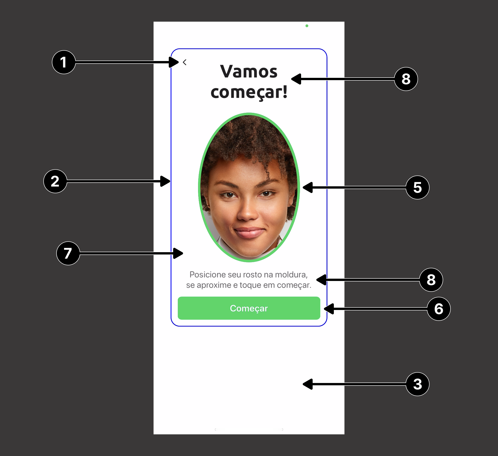
    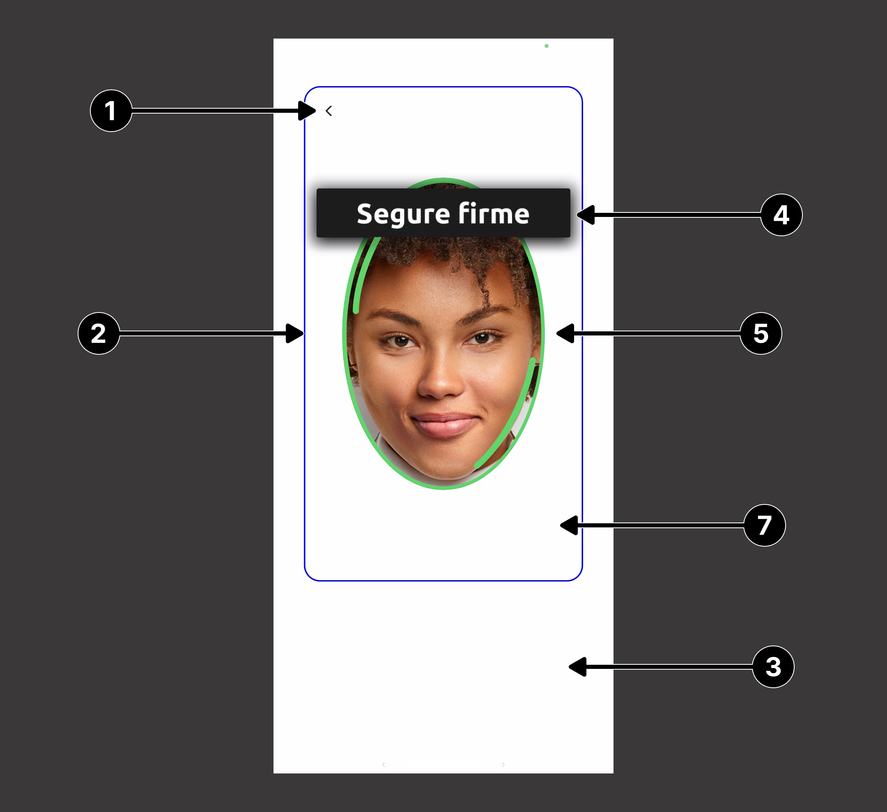
<div/>

---

## Tela de pronto para começar

### 1. Header
| **Atributo**                                           | **Tipo**            | **Descrição**                                 |
| :----------------------------------------------------- | :------------------ | :-------------------------------------------- |
| guidanceCustomizationReadyScreenHeaderFont             | UIFont?             | Adiciona uma fonte customizada para o header. |
| guidanceCustomizationReadyScreenHeaderTextColor        | UIColor?            | Modifica a cor da fonte do texto.             |

### 2. Subtext
| **Atributo**                                            | **Tipo**            | **Descrição**                                  |
| :------------------------------------------------------ | :------------------ | :--------------------------------------------- |
| guidanceCustomizationReadyScreenSubtextFont             | UIFont?             | Adiciona uma fonte customizada para o subtext. |
| guidanceCustomizationReadyScreenSubtextTextColor        | UIColor?            | Modifica a cor da fonte do texto.              |

### 3. Textos

> **_Observação:_**
> As propriedades abaixo só serão aplicadas em telas pequenas. 

| **Atributo**                                               | **Tipo** | **Descrição**                                    |
| :--------------------------------------------------------- | :------- | :----------------------------------------------- |
| guidanceCustomizationReadyScreenOvarFillColor              | UIColor? | ***                                              |
| guidanceCustomizationReadyScreenTextBackgroundColor        | UIColor? | Modifica a cor de fundo.                         |
| guidanceCustomizationReadyScreenTextBackgroundCornerRadius | Int32?   | Modifica o tamanho do arredondamento das bordas. |

<br/>
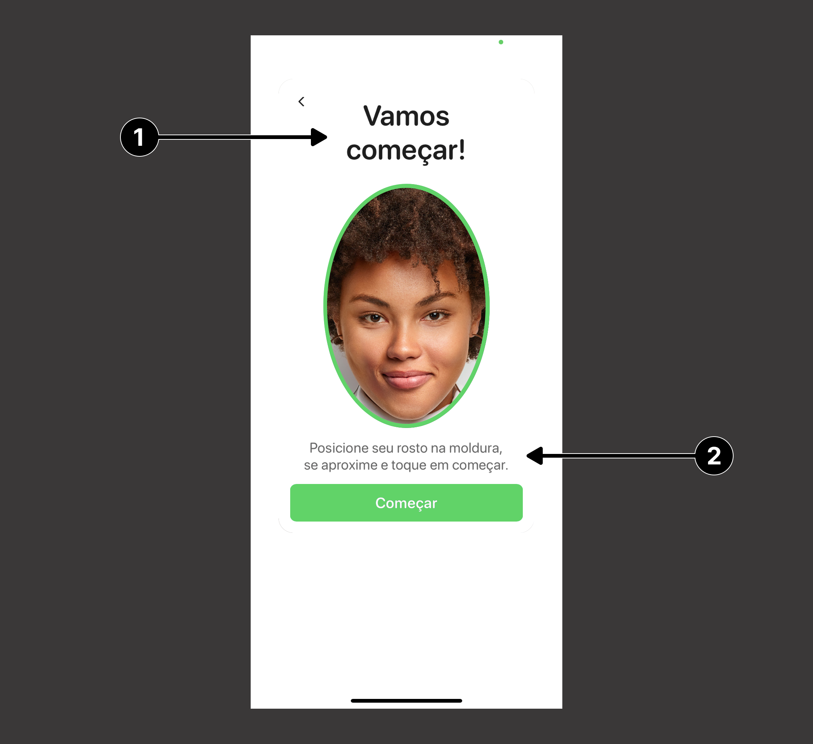

---

## Tela de resultado

### 1. Activity
| **Atributo**                                                     | **Tipo**             | **Descrição**                                                                |
| :--------------------------------------------------------------- | :------------------- | :--------------------------------------------------------------------------- |
| resultScreenCustomizationForegroundColor                         | UIColor?             | Modifica a cor de fundo quando estiver em primeiro plano.                    |
| resultScreenCustomizationBackgroundColors                        | [UIColor]?           | Modifica a cor de fundo e caso receba duas cores diferentes cria um degradê. |
| resultScreenCustomizationActivityIndicatorColor                  | UIColor              | Modifica a cor do activity indicator.                                        |
| resultScreenCustomizationCustomActivityIndicatorImage            | UIImage?             | Adiciona uma imagem customizada para o activity indicator.                   |
| resultScreenCustomizationCustomActivityIndicatorRotationIntervar | Int32                | ***                                                                          |
| resultScreenCustomizationCustomActivityIndicatorAnimation        | Int                  | ***                                                                          |
| resultAnimationStyle                                             | ResultAnimationStyle | Determina o tipo de animação será utilizada juntamente com sua customização. |

```swift
public enum ResultAnimationStyle {
    case blob
    case spinner(SpinnerAnimationCustomization)
    case custom(CustomResultAnimationDelegate)
}

public struct SpinnerAnimationCustomization {
    let spinnerColor: UIColor
    let indicatorForegroundColor: UIColor
    let indicatorBackgroundColor: UIColor
}

public protocol CustomResultAnimationDelegate {
    func createActivityIndicatorView() -> UIView?
    func createSuccessAnimationView() -> UIView?
}
```

### 2. Barra de carregamento
| **Atributo**                                      | **Tipo** | **Descrição**                                                        |
| :------------------------------------------------ | :------- | :------------------------------------------------------------------- |
| resultScreenCustomizationShowUploadProgressBar    | Bool     | Propriedade booleana que ativa a visualização da barra de progresso. |
| resultScreenCustomizationUploadProgressFillColor  | UIColor  | Modifica a cor do preenchimento da barra de progresso.               |
| resultScreenCustomizationUploadProgressTrackColor | UIColor  | Modifica a cor da barra de progresso.                                |

### 3. Animação
| **Atributo**                                                     | **Tipo** | **Descrição**                                                                         |
| :--------------------------------------------------------------- | :------- | :------------------------------------------------------------------------------------ |
| resultScreenCustomizationAnimationRelativeScale                  | Float    | ***                                                                                   |
| resultScreenCustomizationResultAnimationBackgroundColor          | UIColor  | Modifica a cor de fundo da imagem que aparece após a animação finalizar.              |
| resultScreenCustomizationResultAnimationForegroundColor          | UIColor  | Modifica a cor do icone que vai aparecer em primeiro plano após a animação finalizar. |
| resultScreenCustomizationResultAnimationSuccessBackgroundImage   | UIImage? | Adiciona uma imagem customizada após a animação finalizar com sucesso.                |
| resultScreenCustomizationResultAnimationUnSuccessBackgroundImage | Int      | Adiciona uma imagem customizada após a animação finalizar com erro.                   |
| resultScreenCustomizationCustomResultAnimationSuccess            | Int      | ***                                                                                   |
| resultScreenCustomizationCustomResultAnimationUnSuccess          | Int      | ***                                                                                   |
| resultScreenCustomizationCustomStaticResultAnimationSuccess      | Int      | ***                                                                                   |
| resultScreenCustomizationCustomStaticResultAnimationUnSuccess    | Int      | ***                                                                                   |

### 4. Mensagem de sucesso
| **Atributo**                         | **Tipo** | **Descrição**                                              |
| :----------------------------------- | :------- | :--------------------------------------------------------- |
| resultScreenCustomizationMessageFont | UIFont?  | Adiciona uma fonte customizada para a mensagem de sucesso. |

<br/>
<div>
    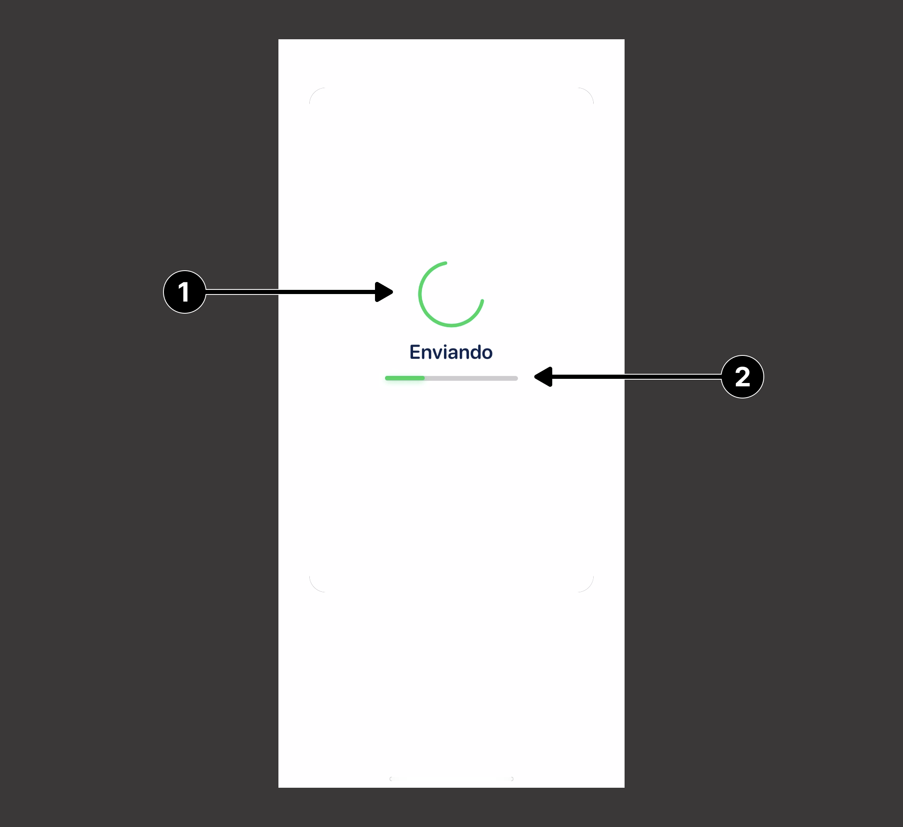
    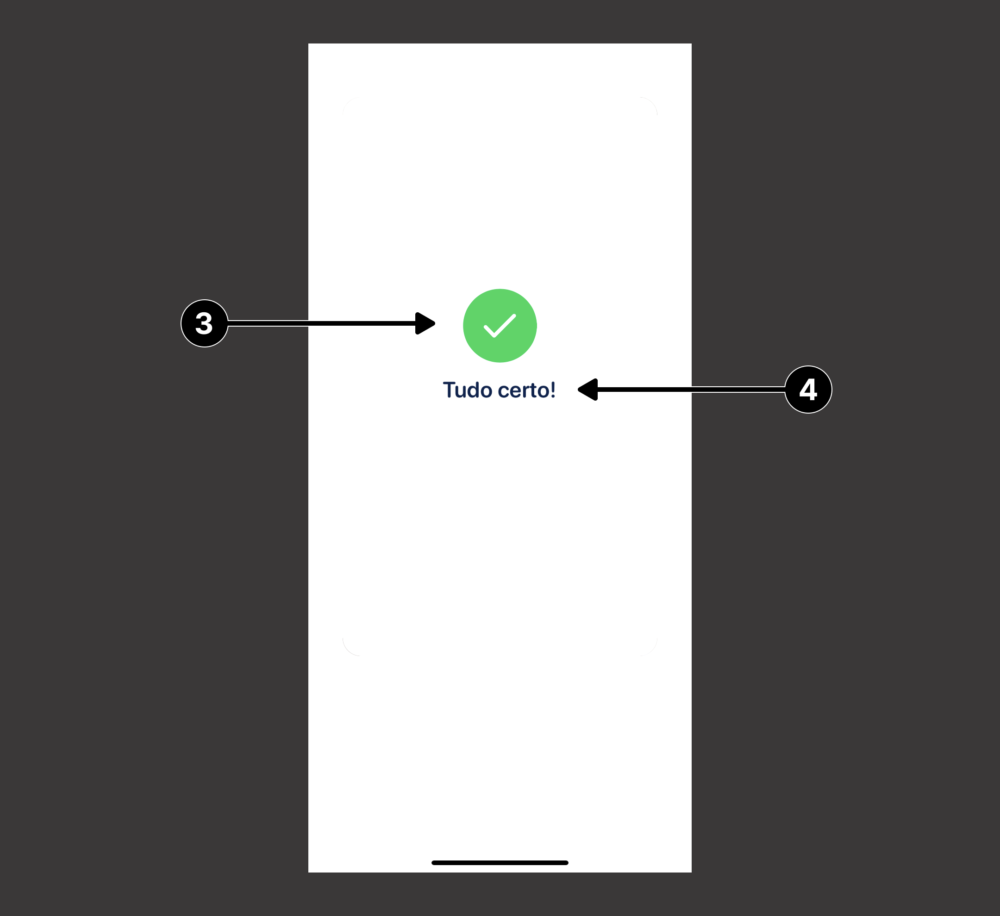
<div/>

---

## Tela de tente novamente

### 1. Header
| **Atributo**                                           | **Tipo**            | **Descrição**                                             |
| :----------------------------------------------------- | :------------------ | :-------------------------------------------------------- |
| guidanceCustomizationRetryScreenHeaderFont             | UIFont?             | Adiciona uma fonte customizada para a mensagem do header. |
| guidanceCustomizationRetryScreenHeaderTextColor        | UIColor?            | Modifica a cor da fonte do header.                        |

### 2. Customização do Subtext
| **Atributo**                                            | **Tipo**            | **Descrição**                                              |
| :------------------------------------------------------ | :------------------ | :--------------------------------------------------------- |
| guidanceCustomizationRetryScreenSubtextFont             | UIFont?             | Adiciona uma fonte customizada para a mensagem do subtext. |
| guidanceCustomizationRetryScreenSubtextTextColor        | UIColor?            | Modifica a cor da fonte do subtext.                        |

### 4. Imagem
| **Atributo**                                      | **Tipo** | **Descrição**                                                     |
| :------------------------------------------------ | :------- | :---------------------------------------------------------------- |
| guidanceCustomizationRetryScreenImageBorderColor  | UIColor  | Modifica a cor da borda do preview da imagem de retentativa.      |
| guidanceCustomizationRetryScreenImageBorderWidth  | Int32?   | Modifica a largura da borda do preview da imagem de retentativa.  |
| guidanceCustomizationRetryScreenImageCornerRadius | Int32?   | Modifica o tamanho do arredondamento das bordas.                  |
| guidanceCustomizationRetryScreenOvarStrokeColor   | UIColor? | Modifica a cor da borda do preview oval da imagem de retentativa. |

<br/>
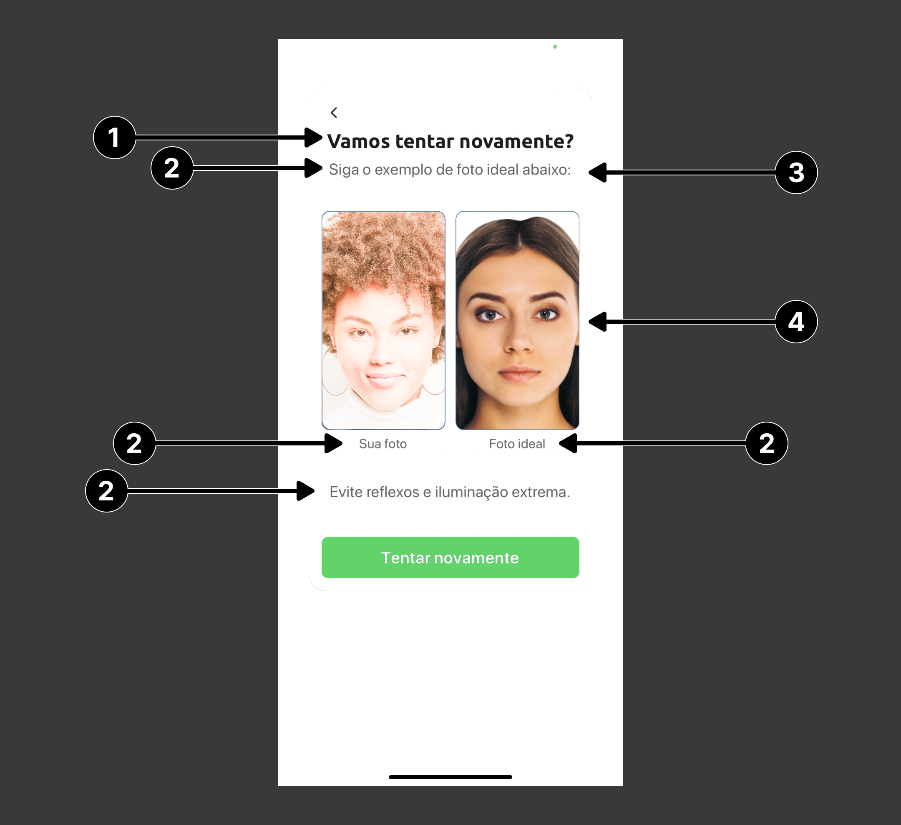

---

## Animação

A animação da tela de resultado pode assumir três valores: `blob`, `spinner()` ou `custom()`, esses valores são atribuídos a propriedade `resultAnimationStyle` do `Liveness3DTheme`. Caso nenhum valor seja atribuído a essa propriedade o valor `spinner()` será aplicado por padrão.

```swift
var theme = Liveness3DTheme(.light)

theme.resultAnimationStyle = .blob
theme.resultAnimationStyle = .spinner(customization)
theme.resultAnimationStyle = .custom(delegate)
```

<br>

### **Blob Animation**

<br>

| **Descrição**            | **Animação**                                                   | **Customização**                                                                                                       |
| :----------------------- | :------------------------------------------------------------- | :--------------------------------------------------------------------------------------------------------------------- |
| Exemplo da <br> Animação | 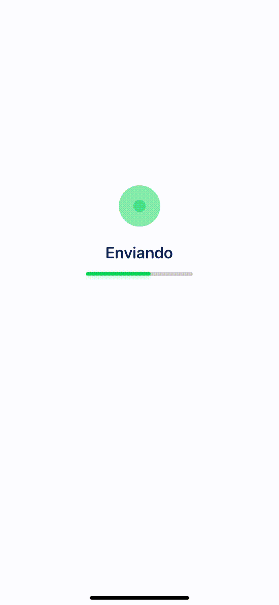 | A customização da animação de Blob é definida <br> pelos parâmetros do `Liveness3DTheme` listados<br>na tabela abaixo: |

<br>

| **Indice** | **Propriedade**                                           | **Tipo** | **Descrição**                                                                   |
| :--------- | :-------------------------------------------------------- | :------- | :------------------------------------------------------------------------------ |
| (**1**)    | `resultScreenCustomizationActivityIndicatorColor`         | UIColor  | Altera a cor do *blob*                                                          |
| (**2**)    | `resultScreenCustomizationResultAnimationForegroundColor` | UIColor  | Altera a cor do *checkmark* ao final<br>da animação de carregamento.            |
| (**3**)    | `resultScreenCustomizationResultAnimationBackgroundColor` | UIColor  | Altera a cor do circulo do *checkmark*<br>ao final da animação de carregamento. |

<br>

### Código de customização

```swift
theme.resultScreenCustomizationActivityIndicatorColor = .blue
theme.resultScreenCustomizationResultAnimationForegroundColor = .systemPink
theme.resultScreenCustomizationResultAnimationBackgroundColor = .yellow
theme.resultAnimationStyle = .blob
```
<br>

### Resultado

<div>
    
    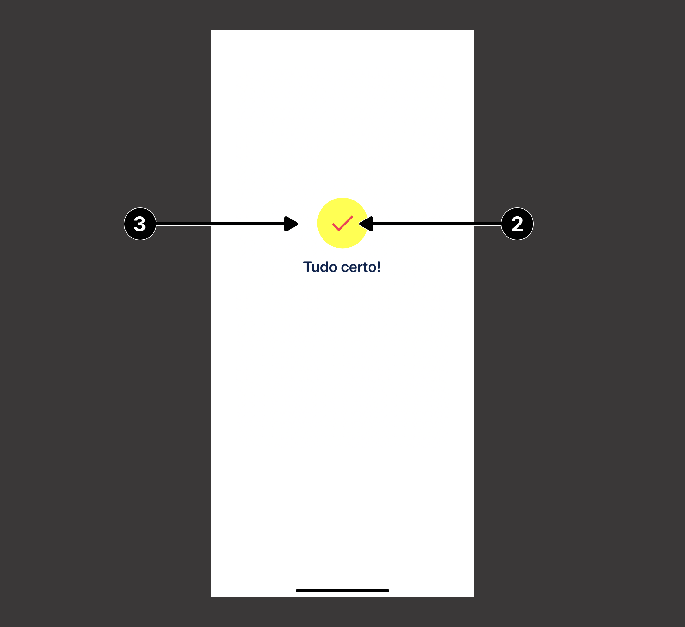
</div>

***
<br>

### **Spinner Animation**
<br>

| **Descrição**            | **Animação**                                                      | **Customização**                                                                                            |
| :----------------------- | :---------------------------------------------------------------- | :---------------------------------------------------------------------------------------------------------- |
| Exemplo da <br> Animação | 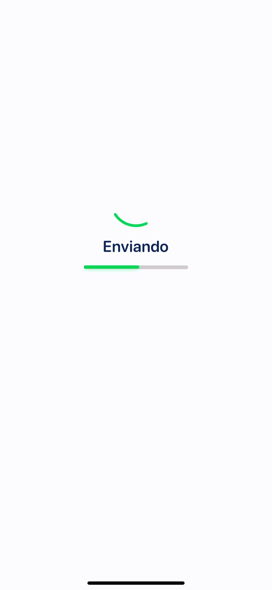 | A customização da animação de Spinner é feita através do<br>objeto do tipo `SpinnerAnimationCustomization`. |

### `SpinnerAnimationCustomization`
| **Indice** | **Propriedade**            | **Tipo** | **Descrição**                                                                   |
| :--------- | :------------------------- | :------- | :------------------------------------------------------------------------------ |
| (**1**)    | `spinnerColor`             | UIColor  | Altera a cor do *spinner*                                                       |
| (**2**)    | `indicatorForegroundColor` | UIColor  | Altera a cor do *checkmark* ao final<br>da animação de carregamento.            |
| (**3**)    | `indicatorBackgroundColor` | UIColor  | Altera a cor do circulo do *checkmark*<br>ao final da animação de carregamento. |

<br>

### Código de customização

```swift
let customization = SpinnerAnimationCustomization(
    spinnerColor: .red,
    indicatorForegroundColor: .yellow,
    indicatorBackgroundColor: .blue
)
theme.resultAnimationStyle = .spinner(customization)
```
<br>

### Resultado

<div>
    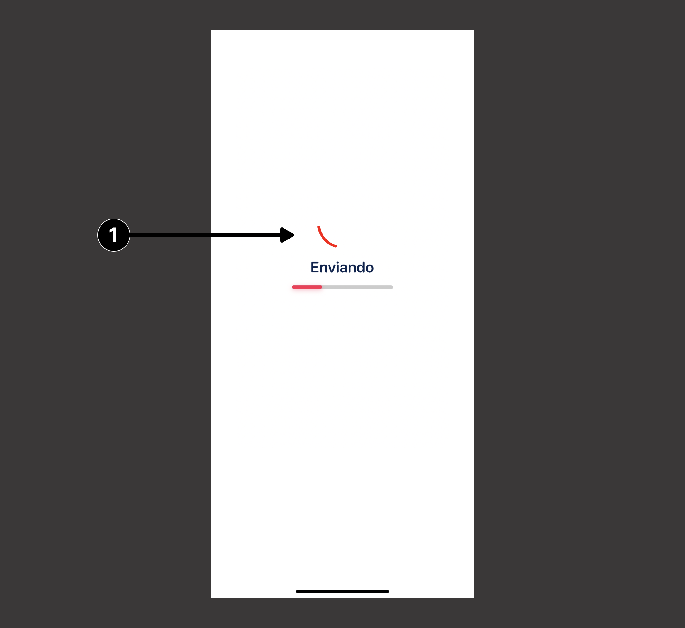
    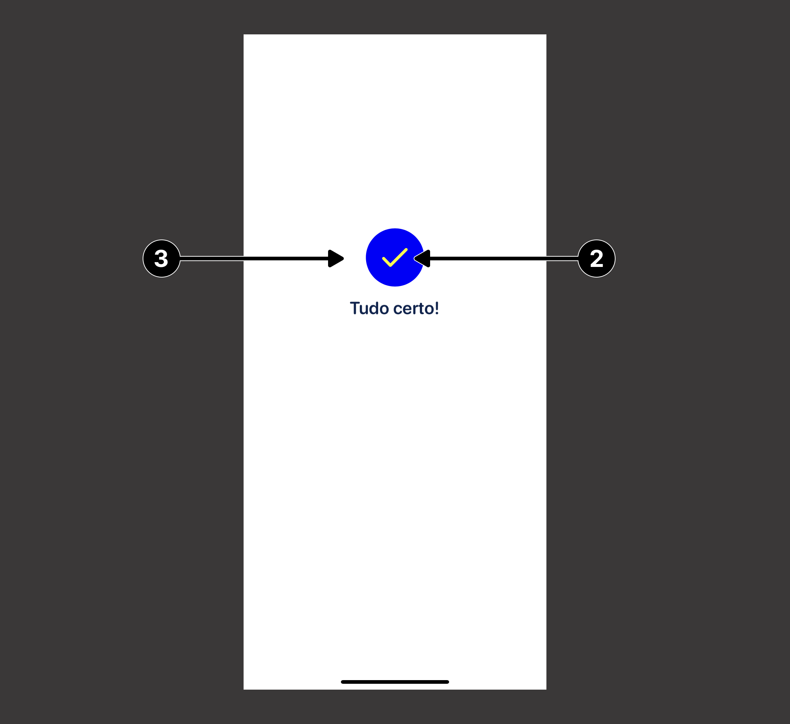
</div>

***

### **Custom Animation**
<br>

| **Descrição**            | **Animação**                                                     | **Customização**                                                                                                                            |
| :----------------------- | :--------------------------------------------------------------- | :------------------------------------------------------------------------------------------------------------------------------------------ |
| Exemplo da <br> Animação | 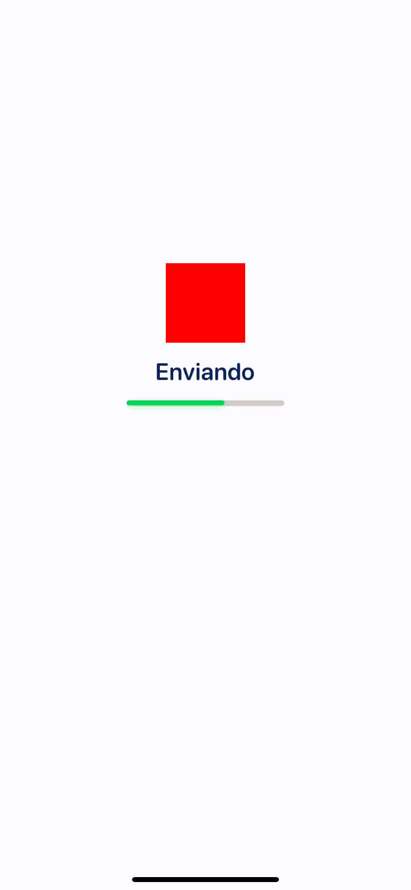 | A animação personalizada é feita através de um<br>objeto que deve estar em conformidade com o<br>protocolo `CustomResultAnimationDelegate`. |

### `CustomResultAnimationDelegate`
| **Indice** | **Método**                      | **Tipo de retorno** | **Descrição**                                                        |
| :--------- | :------------------------------ | :------------------ | :------------------------------------------------------------------- |
| (**1**)    | `createActivityIndicatorView()` | UIView?             | Altera a cor do *spinner*                                            |
| (**2**)    | `createSuccessAnimationView()`  | UIView?             | Altera a cor do *checkmark* ao final<br>da animação de carregamento. |

<br>

### Código de customização

```swift
class CustomResultAnimation: CustomResultAnimationDelegate {
    func createActivityIndicatorView() -> UIView? {
        let activityIndicator = UIView()
        activityIndicator.backgroundColor = .red
        return activityIndicator
    }
    
    func createSuccessAnimationView() -> UIView? {
        let successAnimation = UIView()
        successAnimation.backgroundColor = .blue
        return successAnimation
    }
}
```

```swift
theme.resultAnimationStyle = .custom(CustomResultAnimation())
```
<br>

### Resultado

<div>
    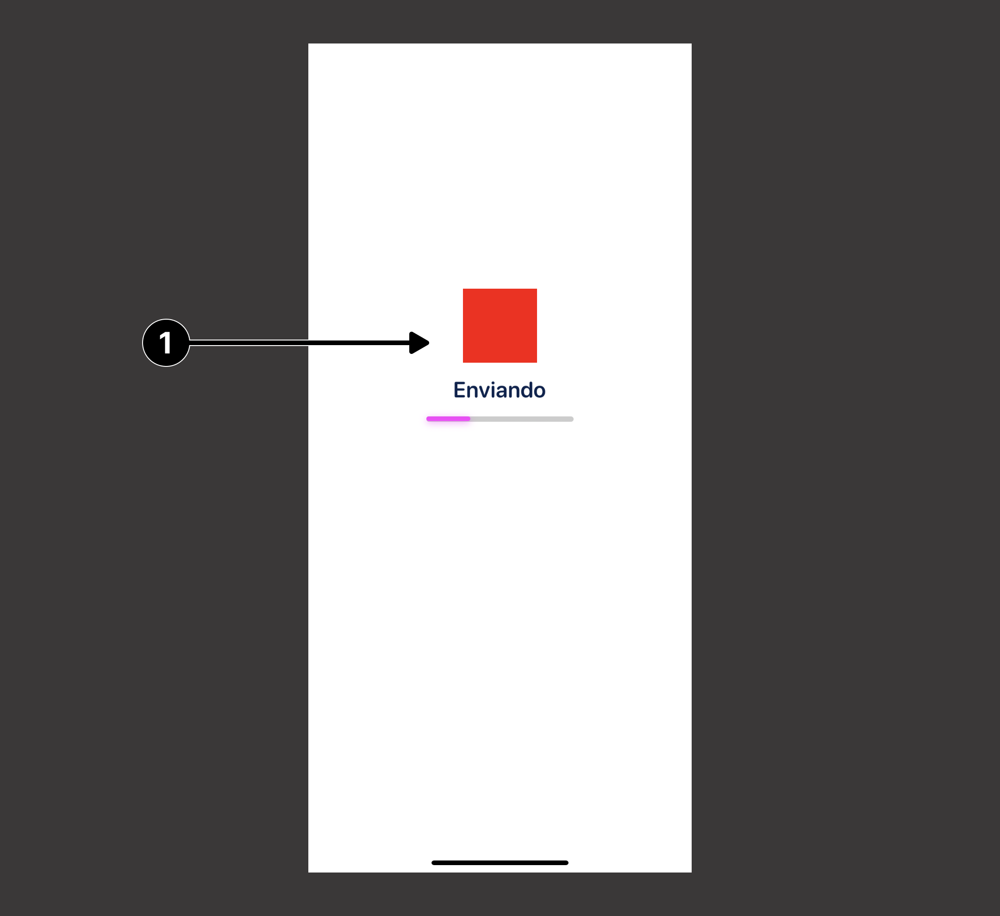
    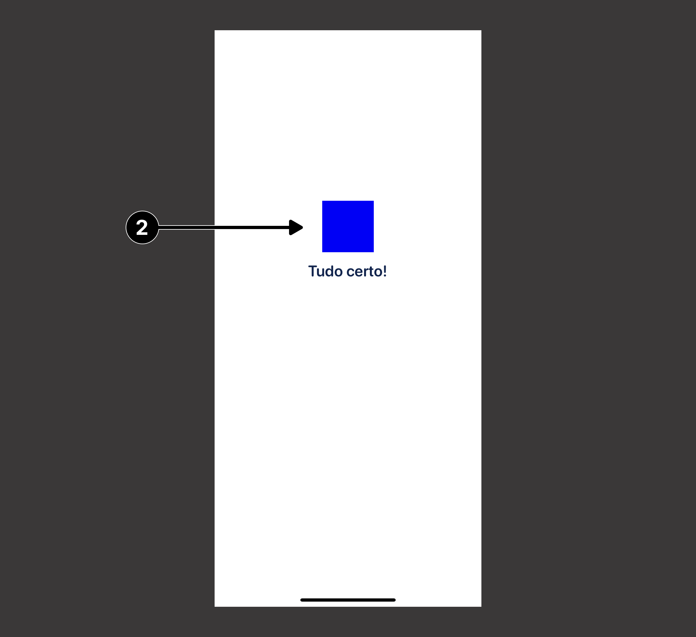
</div>
