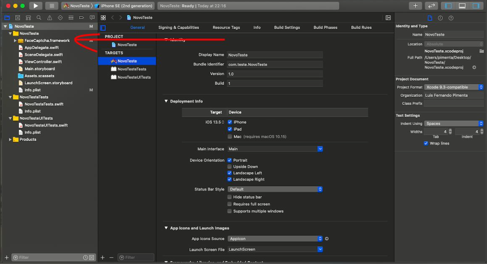
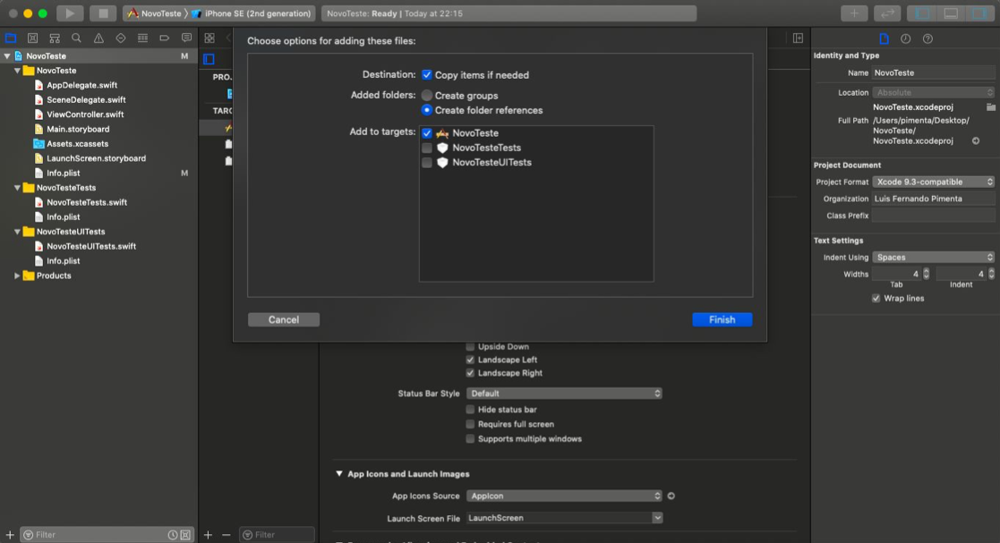
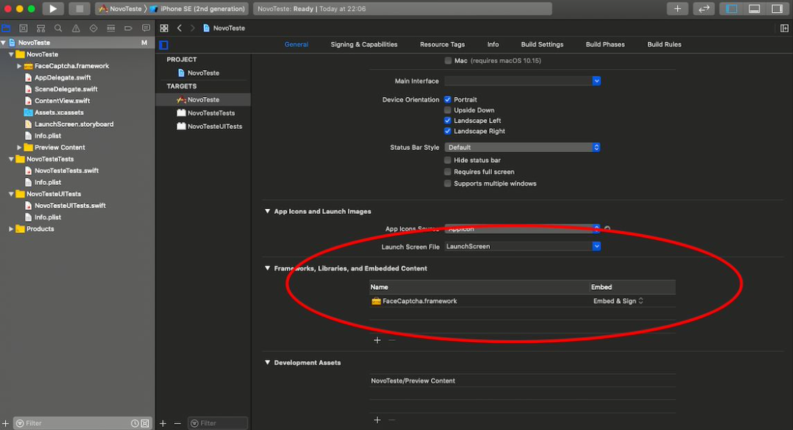

# Liveness - Instalação Manual

1. Arraste o `FaceCaptcha.framework` para dentro do projeto:

2. Não se esqueça de marcar as opções abaixo:

3.  Nas configurações gerais do projeto, selecione o `​FaceCaptcha.framework​` e deixe em `Embed: Embed & Sign`:

